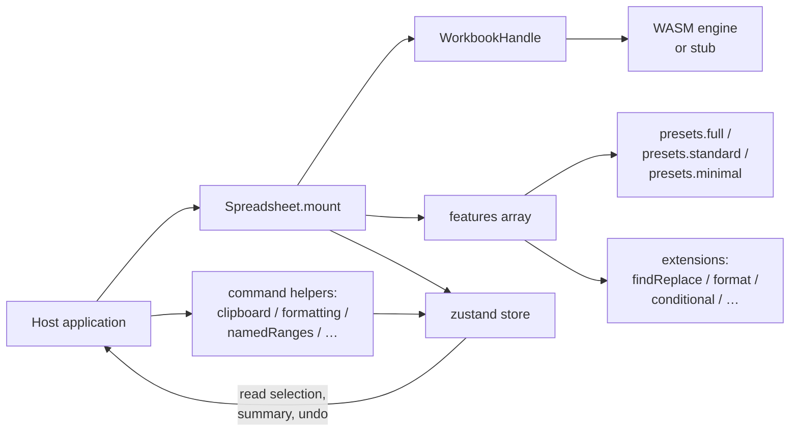

# Embedding Guide

`formulon-cell` is designed to be embedded. The bundled playground happens to mount the package with `presets.full()`, but most applications will drop down to a smaller preset and add only the pieces they need.

::: info Glossary: preset vs extension
A *preset* is a curated list of features. An *extension* is a single composable feature factory. `presets.full()` returns what amounts to a long array of extensions; you can build the same array yourself.
:::

## Three host shapes



1. **Drop-in spreadsheet.** Use a preset, accept the default chrome, customize via i18n and themes.
2. **Mixed chrome.** Use `presets.minimal()` and add only the dialogs / toolbars you need as extensions.
3. **Headless surface.** Mount the canvas without chrome, drive it from your application's own toolbar via [command helpers](#command-helpers).

## Drop-in mount

```ts
import { Spreadsheet, WorkbookHandle, presets } from '@libraz/formulon-cell'
import '@libraz/formulon-cell/styles.css'
import '@libraz/formulon-cell/styles/paper.css'

const host = document.getElementById('sheet')!
const workbook = await WorkbookHandle.createDefault()

const instance = await Spreadsheet.mount(host, {
  workbook,
  features: presets.full(),
  locale: 'en',
  theme: 'paper'
})
```

## Selective extensions

Replaceable factories live in the same export:

```ts
import {
  Spreadsheet,
  presets,
  findReplaceExtension,
  formatDialogExtension,
  pasteSpecialExtension,
  conditionalFormatExtension,
  iterativeSettingsExtension,
  goToSpecialExtension,
  pageSetupExtension,
  namedRangesExtension,
  hyperlinkDialogExtension,
  pivotTableCreationExtension,
  validationExtension,
  autocompleteExtension,
  hoverCommentsExtension,
  viewToolbarExtension,
  quickAnalysisExtension
} from '@libraz/formulon-cell'

const instance = await Spreadsheet.mount(host, {
  workbook,
  features: [
    ...presets.minimal(),
    viewToolbarExtension(),
    findReplaceExtension(),
    formatDialogExtension(),
    namedRangesExtension(),
    autocompleteExtension()
  ]
})
```

The order in the array is the activation order. Most extensions are independent, but a few cooperate (e.g. `pasteSpecialExtension` integrates with the clipboard command helper). When in doubt, mirror the order in `presets.full()`.

## Headless mount

```ts
const headless = await Spreadsheet.mount(host, {
  workbook,
  features: presets.minimal(),
  locale: 'en'
})

// Read what the engine knows
const sheets = headless.store.getState().workbookSummary.sheets
```

From there, drive selection and edits from your own toolbar using [command helpers](#command-helpers).

## Command helpers

The package exports engine-backed command functions that the chrome and extensions also use internally. They work the same when called from your own toolbar:

```ts
import {
  clipboardCommands,
  formattingCommands,
  namedRangesCommands,
  selectionAggregates,
  validationCommands
} from '@libraz/formulon-cell'

clipboardCommands.copy(instance.store)
formattingCommands.applyNumberFormat(instance.store, '#,##0.00')
namedRangesCommands.add(instance.store, { name: 'Revenue', refersTo: 'Sheet1!$B$2:$B$13' })
const stats = selectionAggregates.summary(instance.store)
console.log(stats.sum, stats.count)
```

::: tip Same code path as the built-in chrome
Whatever the built-in toolbars do, the command helpers do the same way. That means features stay in sync — a host-built toolbar gets the same undo entries, the same recalc behavior, and the same event emissions.
:::

## Lifecycle hooks

Mount returns a `SpreadsheetInstance` with `dispose()`:

```ts
useEffect(() => {
  let instance: SpreadsheetInstance | undefined
  ;(async () => {
    instance = await Spreadsheet.mount(host, { workbook, features: presets.minimal() })
  })()
  return () => instance?.dispose()
}, [])
```

`dispose()` detaches event listeners, unmounts DOM, and releases the engine reference held by the chrome. The `WorkbookHandle` itself is owned by the caller; release it with `wb.delete()` when the application is done.

## Stub-engine detection

```ts
import { WorkbookHandle, isUsingStub } from '@libraz/formulon-cell'

const wb = await WorkbookHandle.createDefault()
if (isUsingStub()) {
  showBanner('Calculation features are disabled — running on the stub engine.')
}
```

`isUsingStub()` reflects whether the WASM engine could initialize. It does not change at runtime once the workbook is created. See [Bundler setup](/cell/bundler) for the COOP/COEP requirements that prevent the stub fallback.

## React adapter

```tsx
import { Spreadsheet, presets } from '@libraz/formulon-cell-react'

export function Sheet() {
  return (
    <Spreadsheet
      features={presets.standard()}
      locale="en"
      theme="paper"
      onSelectionChange={(event) => console.log(event.active)}
    />
  )
}
```

The React adapter mounts and disposes for you and forwards events as props. For more control, drop down to the vanilla package.

## Vue adapter

```vue
<script setup lang="ts">
import { Spreadsheet, presets } from '@libraz/formulon-cell-vue'
</script>

<template>
  <Spreadsheet
    :features="presets.standard()"
    locale="en"
    theme="paper"
    @selection-change="(event) => console.log(event.active)"
  />
</template>
```

## Read next

- [i18n](/cell/i18n) — locale registration and overrides.
- [API surface](/cell/api) — events, store, command helpers.
- [Bundler setup](/cell/bundler) — what the host must serve.
