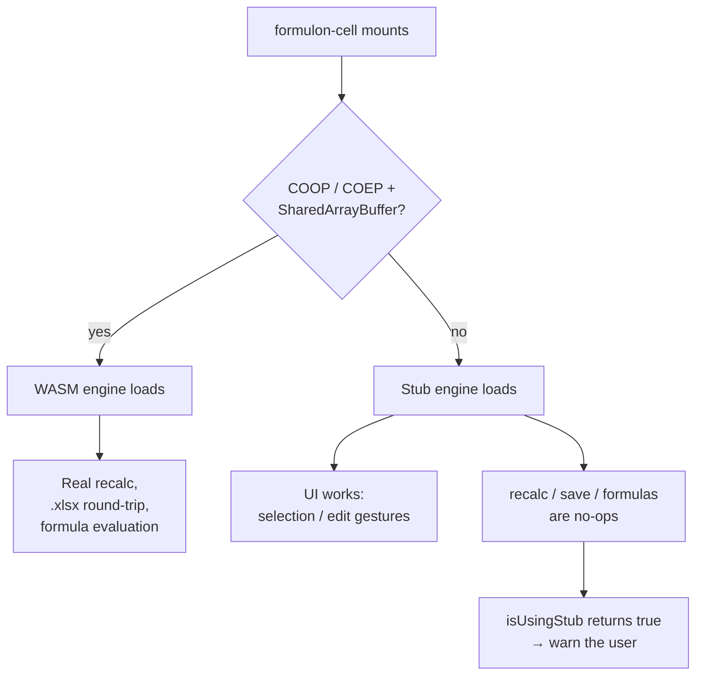

# formulon-cell

`@libraz/formulon-cell` is a beta spreadsheet UI package that sits on top of the `@libraz/formulon` WASM calculation engine. In this site it is used primarily as a **demonstration host**: Formulon remains the headless engine, while `formulon-cell` provides a concrete workbook surface for browser inspection.

Use it when you want desktop-spreadsheet-style chrome around the engine — a canvas-rendered grid, formula bar, status bar, sheet tabs, selection, keyboard editing, context menus, runtime i18n, theme tokens, and optional authoring dialogs. If your application only needs calculation, workbook loading, or headless regression checks, start with the Formulon runtime docs instead.

::: info Glossary: chrome (UI)
The non-content parts of a UI surface that surround the working area — toolbars, menus, status bar, scrollbars, dialogs. *Chrome* in this sense is unrelated to the Chrome browser.
:::

::: info Glossary: canvas-rendered grid
A grid drawn into an HTML `<canvas>` element rather than as DOM nodes. The grid stays performant on workbooks with tens of thousands of cells because cells are not individual elements; the trade-off is that DOM-based accessibility and CSS styling apply only to the chrome around the canvas.
:::

## What It Shows

- A real browser workbook backed by `@libraz/formulon`.
- Function entry, formula recalculation, and visible cell results.
- A canvas-rendered spreadsheet surface using the same store and command helpers that host applications can compose.
- Runtime i18n with `en` and `ja` dictionaries.
- Light (`paper`) and dark (`ink`) themes through CSS variable tokens.
- A deliberately app-like UI for this demonstration, not the canonical Formulon product interface.

## Packages

| Package | Purpose |
| --- | --- |
| `@libraz/formulon-cell` | Vanilla TS / DOM core, framework-free |
| `@libraz/formulon-cell-react` | React 18+ component and hooks |
| `@libraz/formulon-cell-vue` | Vue 3 component and composables |

```sh
npm install @libraz/formulon-cell zustand
# adapters (optional)
npm install @libraz/formulon-cell-react react react-dom
npm install @libraz/formulon-cell-vue vue
```

::: info Why is zustand a peer?
`zustand` is exposed as a peer dependency so host applications can subscribe to *the same store* the built-in chrome subscribes to. This lets you build custom status bars, side panels, or analytics observers without forking the package.
:::

## Stub engine fallback

The WASM engine ships pthread-enabled and needs `SharedArrayBuffer`. Without cross-origin isolation (`Cross-Origin-Opener-Policy: same-origin` + `Cross-Origin-Embedder-Policy: require-corp`), `formulon-cell` falls back to an in-memory **stub engine**: the UI keeps rendering and responding to selection and edit gestures, but formula evaluation, recalculation, and `.xlsx` round-trip degrade to no-ops.



Detect at runtime:

```ts
import { WorkbookHandle, isUsingStub } from '@libraz/formulon-cell'

const wb = await WorkbookHandle.createDefault()
if (isUsingStub()) {
  console.warn('formulon-cell: stub engine in use — recalc disabled')
}
```

See [Bundler setup](/cell/bundler) for the hosting headers and [Install](/cell/install) for the runtime contract.

## Full Demo

The homepage includes a compact live function picker. The fuller UI/UX demo opens the bundled `formulon-cell` playground in an overlay window so it remains clearly framed as a demo surface.

[Open the full UI demo](/cell/demo)

## Read next

- [Install](/cell/install) — package install and stub-engine contract.
- [Bundler setup](/cell/bundler) — Vite / webpack / esbuild requirements.
- [Embedding guide](/cell/embedding) — presets, extensions, command helpers, headless usage.
- [i18n](/cell/i18n) — locale switching and dictionary registration.
- [API surface](/cell/api) — Spreadsheet / WorkbookHandle / events / store.
