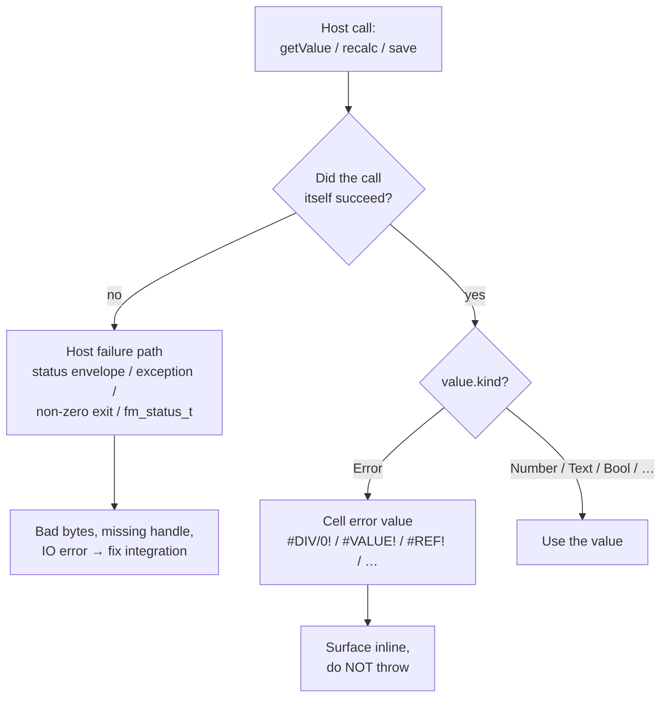

# Error Model

Spreadsheet errors are **first-class values**. A formula returning `#DIV/0!` did not crash — it produced an error value, and the host API call that retrieved it succeeded. This separation is preserved across every binding.

::: info Glossary: cell error vs host failure
A *cell error* is a value with `kind = Error`. It travels through the binding as data. A *host failure* means the host operation itself failed (bad bytes, missing handle, IO error, internal engine failure) and is reported through a separate channel — `Status` envelope, exception, non-zero exit, or `fm_status_t`.
:::



| Error | Meaning |
| --- | --- |
| `#DIV/0!` | Division by zero |
| `#VALUE!` | Wrong type or incompatible value |
| `#REF!` | Invalid reference (deleted sheet, broken range) |
| `#NAME?` | Unknown name or function |
| `#NUM!` | Numeric overflow or invalid numeric domain |
| `#N/A` | Value not available |
| `#NULL!` | Range intersection produced empty range |
| `#SPILL!` | Dynamic-array spill conflict |
| `#CALC!` | Engine could not produce a result |
| `#GETTING_DATA` | Asynchronous external lookup in progress |

Bindings should preserve these values instead of converting them into host exceptions unless the host API is reporting an API misuse or IO failure.

## Host failure paths

| Surface | Host failure path |
| --- | --- |
| WASM | `status.ok === false` or invalid workbook handle plus `lastErrorMessage()` |
| Python | `FormulonError` |
| CLI | non-zero exit code and diagnostic on stderr |
| C ABI | non-zero `fm_status_t` plus `fm_last_error_message()` / `fm_last_error_context()` |
| MCP | MCP error response with structured payload |
| Native Node | `status.ok === false` on the returned envelope |

## C ABI value kinds

| Kind | Meaning |
| --- | --- |
| `FM_VAL_BLANK` | Blank cell |
| `FM_VAL_NUMBER` | IEEE-754 double |
| `FM_VAL_BOOL` | Boolean |
| `FM_VAL_TEXT` | UTF-8 workbook-owned text view |
| `FM_VAL_ERROR` | Excel error code ordinal |
| `FM_VAL_ARRAY` | Reserved payload |
| `FM_VAL_REF` | Reserved payload |
| `FM_VAL_LAMBDA` | Reserved payload |

## Handling pattern

```ts
const value = wb.getValue(0, 0, 0)
if (value.kind === ValueKind.Error) {
  // cell error — surface to the user, do not throw
  showInline(value.errorText)
} else if (value.kind === ValueKind.Number) {
  consume(value.number)
}
```

```python
v = wb.get_value(0, 0, 0)
if v.kind is ValueKind.ERROR:
    show_inline(v.error_text)
elif v.kind is ValueKind.NUMBER:
    consume(v.number)
```

## Read next

- [Formula engine](/workbook/formula-engine) — how errors propagate.
- [Troubleshooting](/start/troubleshooting) — common host failures.
