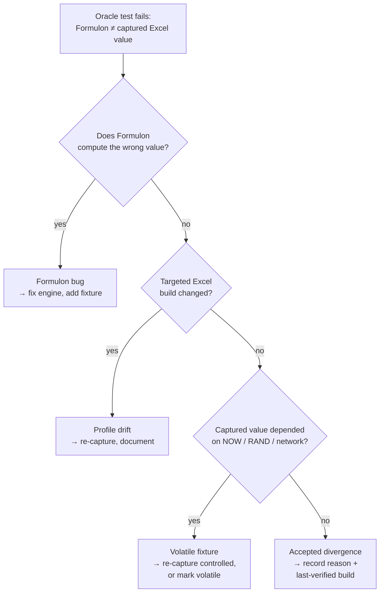

# Oracle Testing

Oracle tests compare Formulon against values captured from real Excel builds. They are the empirical layer of the compatibility story — what *Excel actually does* on a given workbook and locale, not what the documentation says it should.

::: info Glossary: oracle data
A captured set of Excel-produced values for a known workbook, profile, and build. Tests load the workbook, recalculate with Formulon, and compare against the captured values. When they disagree, *Excel* is treated as the source of truth.
:::

::: info Glossary: accepted divergence
A case where Formulon deliberately differs from Excel. Each accepted divergence carries a reason (security, deterministic behavior, fixed Excel bug, …) and a last-verified Excel build. Accepted divergences are documented rather than hidden behind generic "Excel-like" claims.
:::

## Why oracle data matters

Spreadsheet behavior includes many undocumented details: rounding edges, how `TEXT()` formats locale-specific digits, how `DATEVALUE()` handles two-digit years, how blank values coerce, how spill collisions interact with merged cells. Oracle fixtures turn those details into reviewable data and make compatibility regressions visible at PR time rather than after deployment.

## How a failure is interpreted

A failure usually falls into one of four buckets:

| Bucket | What it means | Typical fix |
| --- | --- | --- |
| Formulon bug | Engine produced the wrong value | Fix the engine, add a regression fixture |
| Profile drift | Targeted Excel build changed | Re-capture oracle data, document the change |
| Volatile fixture | Captured value depended on `NOW` / `RAND` / network | Re-capture with controlled inputs, or mark fixture as volatile |
| Accepted divergence | The case is documented as intentionally different | Record it in the divergence list with reason + last-verified build |

## Contributing data

Locale coverage grows when contributors run the oracle capture flow on their own Excel installations. The same workbook can be captured on `win-365-ja_JP`, `mac-365-ja_JP`, and other profiles, expanding what the engine can validate against. See [Oracle contribution](/development/oracle-contribution) for the capture flow.

v0.9.2 added workbook-oracle coverage for pivot tables and print pagination through the Windows Excel bridge, with `win-365-ja_JP` as the primary profile. Mac and Windows captures now share a comparator, which makes cross-platform differences easier to review instead of hiding them as unrelated test output.

## Read next

- [Compatibility model](/compatibility/model) — profiles, divergences, practical rules.
- [Locale profiles](/compatibility/locale-profiles) — which profiles exist today.
- [Oracle contribution](/development/oracle-contribution) — how to add data.
