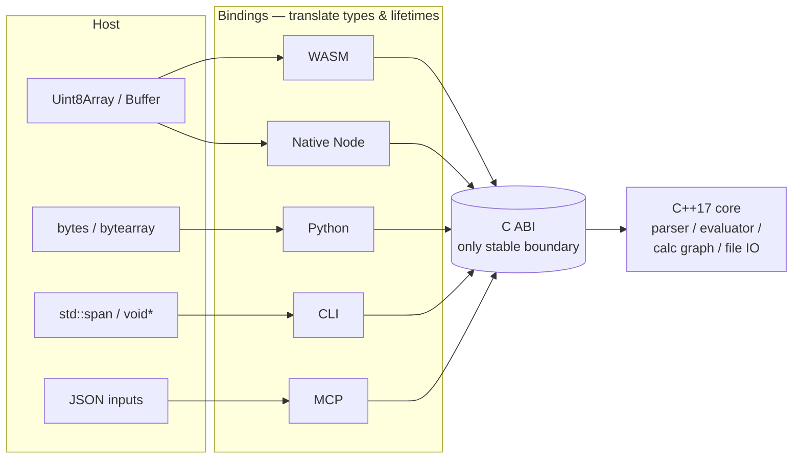

# Bindings

Bindings expose workbook operations to host environments while keeping calculation in the core. Each binding speaks the host language idiom on one side and the C ABI on the other.

::: info Glossary: binding
A thin per-host layer that translates host types (`Uint8Array`, `bytes`, `bytearray`, `std::span`) into engine inputs and engine outputs back into host types. Bindings do not implement formula semantics — they shape data and manage lifetimes.
:::

## Responsibilities

- Convert host buffers to workbook bytes accepted by the C ABI.
- Manage workbook handles and lifetimes (`delete()` in WASM, context manager in Python, automatic GC tie in Native Node, process lifetime in CLI / MCP).
- Convert spreadsheet values to host values, preserving `ValueKind` so cell errors remain values rather than exceptions.
- Surface calculation and IO errors without losing spreadsheet error values.
- Expose the function and structural API documented under [API](/api/) per host.

## Non-responsibilities

Bindings should not:

- implement formula semantics (the parser / evaluator lives in the core),
- duplicate workbook parsing (the OOXML / XLSB readers live in the core),
- add profile-specific behavior (profiles are workbook state, set through the C ABI),
- introduce a separate dirty-set, dependency graph, or recalc scheduler (all of those belong to the core).

::: warning Don't reimplement Excel in the binding
If a binding is tempted to special-case a function result or coerce a value differently than the core, the right fix is in the core: add the case to the evaluator, add an oracle fixture, and let every binding pick up the change at once. Per-binding patches drift fast.
:::

## What this looks like in practice

| Binding | Host idioms it handles | What it never touches |
| --- | --- | --- |
| WASM | `Uint8Array`, status envelopes, `ValueKind` enum, async module factory | Function semantics, file parsing, calc graph |
| Native Node | N-API `Buffer`, sync API shape, GC-tied native handles | Function semantics, file parsing, calc graph |
| Python | `bytes`, context manager, `FormulonError`, `Value.to_python()` | Function semantics, file parsing, calc graph |
| CLI | `argv`, stdin / stdout / stderr, exit codes | Function semantics, file parsing, calc graph |
| MCP | JSON inputs / outputs, session map, allowlist dispatch | Function semantics, file parsing, calc graph |

## Read next

- [Architecture](/development/architecture) — the binding layer in context.
- [C++ core](/development/core) — what the bindings are calling into.
- [Surface matrix](/api/surfaces) — what each binding exposes today.
