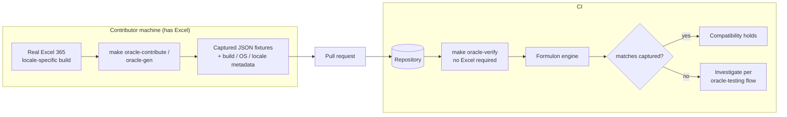

# Oracle Contribution

Oracle data is the main way to expand verified compatibility. Generation drives real Excel; verification reads committed JSON and is safe for CI.

::: info Glossary: oracle generation vs verification
*Generation* runs the oracle capture tooling against a real Excel installation and writes JSON fixtures. It only happens on contributor machines that have Excel. *Verification* reads those committed JSON fixtures and compares them against Formulon output — no Excel required, safe for CI.
:::



## Contributor flow

1. Install Excel 365 for the locale being contributed.
2. Run `make oracle-contribute` from the repository root.
3. Review generated fixtures and metadata.
4. Open a pull request with the captured data.

Each contribution should include platform, Excel build, locale, and profile identity. This keeps failures explainable later — when a fixture starts disagreeing with Formulon two years from now, the metadata tells the maintainer which Excel build to re-capture against.

## Targets

Target names have the shape `<host>-<excel-major>-<locale>`, for example `mac-365-ja_JP` or `win-365-ja_JP`. The manifest lives at `tools/oracle/targets.yaml`.

Current wanted locales include English, German, French, Chinese, Korean, and Thai Excel environments. Contributing one of those targets makes locale-specific behavior concrete instead of guessed.

::: tip Contribution scope
A useful contribution does not have to cover every function. Even a single locale's full fixture run for one function family (text, dates, lookup) is a measurable upgrade in compatibility coverage.
:::

## Commands

```sh
make oracle-setup
make oracle-contribute
make oracle-contribute TARGET=mac-365-en_US
make oracle-gen TARGET=win-365-ja_JP SUITE=count
make oracle-verify
```

`make oracle-verify` is what runs in CI; the others need Excel and run only on contributor machines.

## What gets reviewed

PRs adding oracle data are reviewed for:

- correct target naming and manifest entry,
- captured Excel build / OS / locale metadata,
- fixtures live under the right path so the verifier discovers them,
- no accidental inclusion of personal data in screenshots or sample inputs.

## Read next

- [Compatibility model](/compatibility/model) — why this work matters.
- [Oracle testing](/compatibility/oracle-testing) — how the data is used in tests.
- [Locale profiles](/compatibility/locale-profiles) — the public profile catalog.
