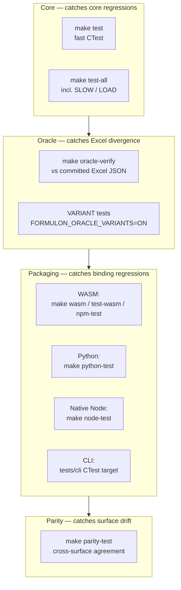

# Test Matrix

The test surface is broader than a single `make test` because Formulon ships multiple packages from one source tree. Different layers (core, oracle, packaging, parity) catch different categories of regression.

::: info Glossary: CTest labels
CTest groups tests with text labels (`SLOW`, `LOAD`, `VARIANT`, …). Targets can include or exclude labels, so a fast pre-commit run can skip slow tests while CI still runs them.
:::



## Core tests

```sh
make build
make test
make test-slow
make test-all
```

`make test` excludes `SLOW` and `LOAD` labels. `make test-all` runs the broadest CTest set. Run `make test` before every commit and `make test-all` before opening a PR that touches the core.

## Oracle tests

```sh
make oracle-verify
```

Oracle verification compares Formulon output with committed JSON generated from Excel. It does not launch Excel and is safe for CI.

Variant oracle tests are opt-in:

```sh
cmake -B build -DFORMULON_ORACLE_VARIANTS=ON
cmake --build build --target formulon_oracle_variant_tests
cd build && ctest -L VARIANT --output-on-failure
```

Use the variant target when investigating profile-specific differences or before adding a new profile.

## Packaging smoke tests

| Surface | Commands |
| --- | --- |
| WASM | `make wasm`, `make test-wasm`, `make npm-test` |
| Python | `make python-test` |
| Native Node | `make node-test` |
| CLI | CTest target under `tests/cli` |

These verify that each binding's `load → mutate → recalc → save` loop still works after a core change.

## Cross-surface parity

```sh
make parity-test
```

The parity runner evaluates shared fixtures across available channels and reports mismatches when two or more surfaces disagree. Channels that have not been built are reported as *missing* rather than as failures — useful when contributing from a machine that does not have Emscripten / Excel / a particular toolchain.

::: tip Parity vs oracle, in one line
Parity says "our surfaces agree with each other." Oracle says "our surfaces agree with Excel." Both signals are needed before a release.
:::

## Diagnostics

| Command | Purpose |
| --- | --- |
| `RegistryCatalog.CoverageReport` | Runtime function-registration status against the canonical catalog |
| `make behavior-status` | Behavior-vocabulary status |
| `make coverage` | Local coverage diagnostic |
| `make mutation` | Local mutation-testing diagnostic |

## Read next

- [Build from source](/development/build-from-source) — what the test targets compile against.
- [Oracle contribution](/development/oracle-contribution) — what feeds `oracle-verify`.
- [Release checklist](/development/release-checklist) — when each test runs in the release flow.
