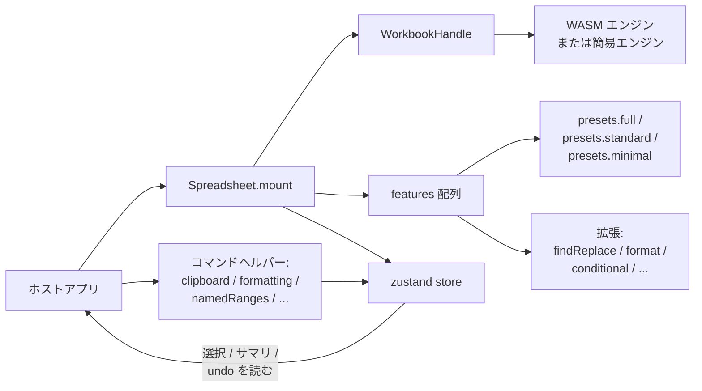

# 埋め込みガイド

`formulon-cell` は埋め込まれることを前提に設計されています。同梱のプレイグラウンドは `presets.full()` を選んでいますが、ほとんどのアプリは小さいプリセットに必要な機能だけを足す形で十分です。

::: info 用語: プリセットと拡張
*プリセット* は機能のまとまり、*拡張* は 1 個の合成可能な機能ファクトリです。`presets.full()` は実体としては長い拡張配列を返しているだけなので、同じ配列を自分で組み立てることもできます。
:::

## 3 つのホスト形



1. **ドロップイン**。プリセットをそのまま使い、i18n とテーマでカスタマイズ。
2. **混在 UI**。`presets.minimal()` をベースに、必要なダイアログ / ツールバーだけ拡張で追加。
3. **ヘッドレス UI**。組み込み UI なしで canvas だけマウントし、アプリ側のツールバーから [コマンドヘルパー](#command-helpers) で駆動。

## ドロップインマウント

```ts
import { Spreadsheet, WorkbookHandle, presets } from '@libraz/formulon-cell'
import '@libraz/formulon-cell/styles.css'
import '@libraz/formulon-cell/styles/paper.css'

const host = document.getElementById('sheet')!
const workbook = await WorkbookHandle.createDefault()

const instance = await Spreadsheet.mount(host, {
  workbook,
  features: presets.full(),
  locale: 'ja',
  theme: 'paper'
})
```

## 選択的な拡張

置換可能なファクトリは同じ export にあります。

```ts
import {
  Spreadsheet,
  presets,
  findReplaceExtension,
  formatDialogExtension,
  pasteSpecialExtension,
  conditionalFormatExtension,
  iterativeSettingsExtension,
  goToSpecialExtension,
  pageSetupExtension,
  namedRangesExtension,
  hyperlinkDialogExtension,
  pivotTableCreationExtension,
  validationExtension,
  autocompleteExtension,
  hoverCommentsExtension,
  viewToolbarExtension,
  quickAnalysisExtension
} from '@libraz/formulon-cell'

const instance = await Spreadsheet.mount(host, {
  workbook,
  features: [
    ...presets.minimal(),
    viewToolbarExtension(),
    findReplaceExtension(),
    formatDialogExtension(),
    namedRangesExtension(),
    autocompleteExtension()
  ]
})
```

配列順が有効化順です。多くの拡張は独立していますが、`pasteSpecialExtension` のようにクリップボード用コマンドヘルパーと協調するものがあります。迷ったら `presets.full()` の順を真似してください。

## ヘッドレスマウント

```ts
const headless = await Spreadsheet.mount(host, {
  workbook,
  features: presets.minimal(),
  locale: 'ja'
})

const sheets = headless.store.getState().workbookSummary.sheets
```

そこからはコマンドヘルパーでアプリ側のツールバーから駆動します。

## コマンドヘルパー

組み込み UI と拡張が内部で使うエンジン連携コマンドを、ホスト側からも同じ形で呼べます。

```ts
import {
  clipboardCommands,
  formattingCommands,
  namedRangesCommands,
  selectionAggregates,
  validationCommands
} from '@libraz/formulon-cell'

clipboardCommands.copy(instance.store)
formattingCommands.applyNumberFormat(instance.store, '#,##0.00')
namedRangesCommands.add(instance.store, { name: 'Revenue', refersTo: 'Sheet1!$B$2:$B$13' })
const stats = selectionAggregates.summary(instance.store)
console.log(stats.sum, stats.count)
```

::: tip 同じコードパスが組み込み UI でも走る
組み込みのツールバーがやることと、コマンドヘルパーがやることは同じ実装です。undo エントリも、再計算の挙動も、イベント発火タイミングも変わりません。
:::

## ライフサイクル

```ts
useEffect(() => {
  let instance: SpreadsheetInstance | undefined
  ;(async () => {
    instance = await Spreadsheet.mount(host, { workbook, features: presets.minimal() })
  })()
  return () => instance?.dispose()
}, [])
```

`dispose()` はリスナを外し、DOM をアンマウントし、組み込み UI が保持していたエンジン参照を解放します。`WorkbookHandle` の所有権は呼び出し側にあり、アプリ終了時に `wb.delete()` で解放してください。

## 簡易エンジンの検出

```ts
import { WorkbookHandle, isUsingStub } from '@libraz/formulon-cell'

const wb = await WorkbookHandle.createDefault()
if (isUsingStub()) {
  showBanner('計算機能は無効です - 簡易エンジンで動作しています。')
}
```

`isUsingStub()` は WASM エンジンの初期化が成功したかを反映します。ワークブック生成後に途中で変わることはありません。簡易エンジンへのフォールバックを避ける COOP/COEP 設定は [バンドラ設定](/ja/cell/bundler)。

## React adapter

```tsx
import { Spreadsheet, presets } from '@libraz/formulon-cell-react'

export function Sheet() {
  return (
    <Spreadsheet
      features={presets.standard()}
      locale="ja"
      theme="paper"
      onSelectionChange={(event) => console.log(event.active)}
    />
  )
}
```

アダプタがマウント / dispose を担当し、イベントを prop で転送します。より細かい制御が必要なら vanilla パッケージを直接使ってください。

## Vue adapter

```vue
<script setup lang="ts">
import { Spreadsheet, presets } from '@libraz/formulon-cell-vue'
</script>

<template>
  <Spreadsheet
    :features="presets.standard()"
    locale="ja"
    theme="paper"
    @selection-change="(event) => console.log(event.active)"
  />
</template>
```

## 次に読むもの

- [i18n](/ja/cell/i18n) ─ ロケール登録と上書き
- [API 一覧](/ja/cell/api) ─ events / store / command
- [バンドラ設定](/ja/cell/bundler) ─ ホストに必要な配信設定
