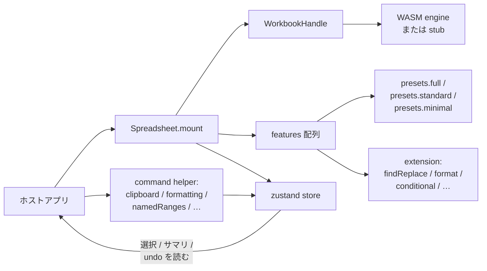

# 埋め込みガイド

`formulon-cell` は埋め込まれることを前提に設計されています。同梱の playground は `presets.full()` を選んでいますが、ほとんどのアプリは小さい preset に必要な機能だけを足す形で十分です。

::: info 用語: preset と extension
*preset* は機能のまとまり、*extension* は 1 個の合成可能な feature factory。`presets.full()` は実体としては長い extension 配列を返しているだけで、同じ配列を自分で組み立てることもできます。
:::

## 3 つのホスト形



1. **ドロップイン**。preset をそのまま使い、i18n とテーマでカスタマイズ。
2. **混在 chrome**。`presets.minimal()` をベースに、必要なダイアログ / ツールバーだけ extension で追加。
3. **ヘッドレス surface**。chrome なしで canvas だけマウントし、アプリ側のツールバーから [command helper](#command-helpers) で駆動。

## ドロップインマウント

```ts
import { Spreadsheet, WorkbookHandle, presets } from '@libraz/formulon-cell'
import '@libraz/formulon-cell/styles.css'
import '@libraz/formulon-cell/styles/paper.css'

const host = document.getElementById('sheet')!
const workbook = await WorkbookHandle.createDefault()

const instance = await Spreadsheet.mount(host, {
  workbook,
  features: presets.full(),
  locale: 'ja',
  theme: 'paper'
})
```

## 選択的 extension

置換可能な factory は同じ export にあります。

```ts
import {
  Spreadsheet,
  presets,
  findReplaceExtension,
  formatDialogExtension,
  pasteSpecialExtension,
  conditionalFormatExtension,
  iterativeSettingsExtension,
  goToSpecialExtension,
  pageSetupExtension,
  namedRangesExtension,
  hyperlinkDialogExtension,
  pivotTableCreationExtension,
  validationExtension,
  autocompleteExtension,
  hoverCommentsExtension,
  viewToolbarExtension,
  quickAnalysisExtension
} from '@libraz/formulon-cell'

const instance = await Spreadsheet.mount(host, {
  workbook,
  features: [
    ...presets.minimal(),
    viewToolbarExtension(),
    findReplaceExtension(),
    formatDialogExtension(),
    namedRangesExtension(),
    autocompleteExtension()
  ]
})
```

配列順がアクティベーション順です。多くの extension は独立していますが、`pasteSpecialExtension` のように clipboard command helper と協調するものがあります。迷ったら `presets.full()` の順を真似してください。

## ヘッドレスマウント

```ts
const headless = await Spreadsheet.mount(host, {
  workbook,
  features: presets.minimal(),
  locale: 'ja'
})

const sheets = headless.store.getState().workbookSummary.sheets
```

そこからは command helper でアプリ側のツールバーから駆動します。

## Command helpers

ビルトイン chrome と extension が内部で使う engine 連携 command を、ホスト側からも同じ形で呼べます。

```ts
import {
  clipboardCommands,
  formattingCommands,
  namedRangesCommands,
  selectionAggregates,
  validationCommands
} from '@libraz/formulon-cell'

clipboardCommands.copy(instance.store)
formattingCommands.applyNumberFormat(instance.store, '#,##0.00')
namedRangesCommands.add(instance.store, { name: 'Revenue', refersTo: 'Sheet1!$B$2:$B$13' })
const stats = selectionAggregates.summary(instance.store)
console.log(stats.sum, stats.count)
```

::: tip 同じコードパスがビルトイン chrome でも走る
ビルトインのツールバーがやることと、command helper がやることは同じ実装です。undo エントリも、recalc 挙動も、イベント発火タイミングも変わりません。
:::

## ライフサイクル

```ts
useEffect(() => {
  let instance: SpreadsheetInstance | undefined
  ;(async () => {
    instance = await Spreadsheet.mount(host, { workbook, features: presets.minimal() })
  })()
  return () => instance?.dispose()
}, [])
```

`dispose()` はリスナを外し、DOM をアンマウントし、chrome が保持していた engine 参照を解放します。`WorkbookHandle` の所有権は呼び出し側にあり、アプリ終了時に `wb.delete()` で解放してください。

## stub engine 検出

```ts
import { WorkbookHandle, isUsingStub } from '@libraz/formulon-cell'

const wb = await WorkbookHandle.createDefault()
if (isUsingStub()) {
  showBanner('計算機能は無効です ─ stub engine で動作しています。')
}
```

`isUsingStub()` は WASM engine の初期化が成功したかを反映します。workbook 生成後に途中で変わることはありません。stub フォールバックを避ける COOP/COEP 設定は [バンドラ設定](/ja/cell/bundler)。

## React adapter

```tsx
import { Spreadsheet, presets } from '@libraz/formulon-cell-react'

export function Sheet() {
  return (
    <Spreadsheet
      features={presets.standard()}
      locale="ja"
      theme="paper"
      onSelectionChange={(event) => console.log(event.active)}
    />
  )
}
```

adapter がマウント / dispose を担当し、イベントを prop で転送します。より細かい制御が必要なら vanilla パッケージに降りてください。

## Vue adapter

```vue
<script setup lang="ts">
import { Spreadsheet, presets } from '@libraz/formulon-cell-vue'
</script>

<template>
  <Spreadsheet
    :features="presets.standard()"
    locale="ja"
    theme="paper"
    @selection-change="(event) => console.log(event.active)"
  />
</template>
```

## 次に読むもの

- [i18n](/ja/cell/i18n) ─ ロケール登録と上書き
- [API 一覧](/ja/cell/api) ─ events / store / command
- [バンドラ設定](/ja/cell/bundler) ─ ホストに必要な配信設定
