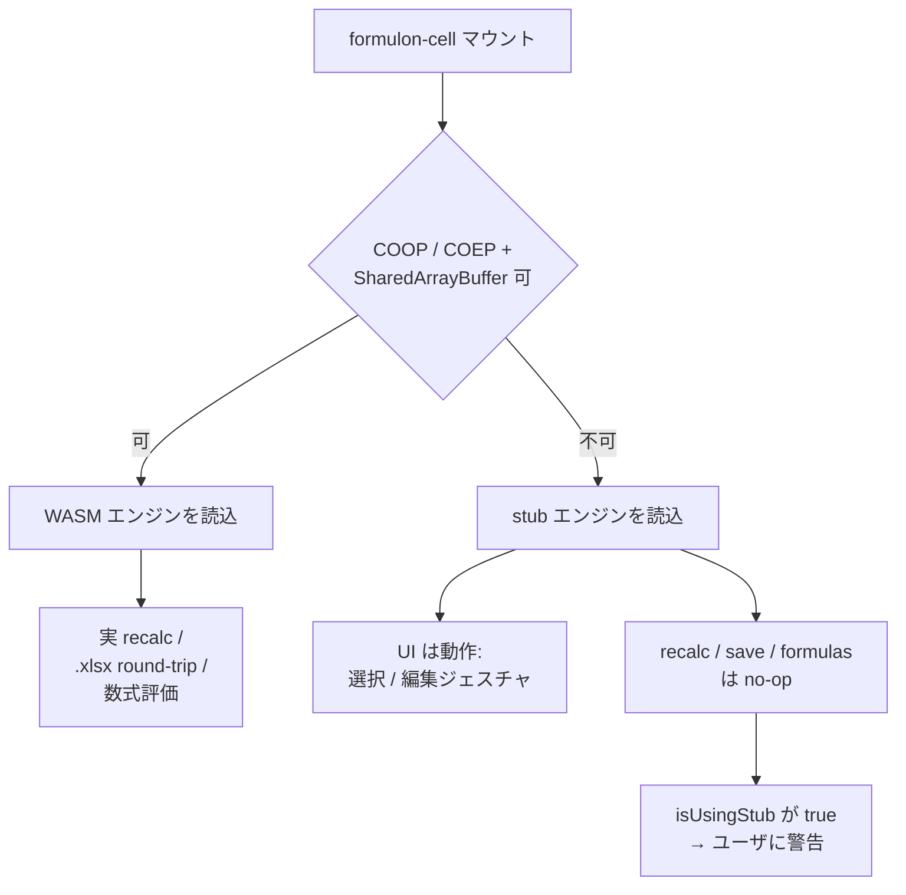

# formulon-cell

`@libraz/formulon-cell` は `@libraz/formulon` WASM 計算エンジンの上に乗るベータ版 spreadsheet UI パッケージです。本サイトでは主に **デモホスト** として使っています。Formulon の主役はヘッドレスな計算エンジンで、`formulon-cell` はブラウザ版をワークブックとして検証するための surface です。

エンジンに desktop-spreadsheet 風の chrome ─ canvas グリッド、数式バー、ステータスバー、シートタブ、選択、キーボード編集、コンテキストメニュー、ランタイム i18n、テーマトークン、各種ダイアログ ─ を被せたいときに使います。計算・読み込み・再計算・ヘッドレス回帰検査だけが目的なら、まず Formulon 本体の実行環境ドキュメントを読んでください。

::: info 用語: chrome（UI 用語）
UI の作業領域を囲む装飾部分 ─ ツールバー、メニュー、ステータスバー、スクロールバー、ダイアログなど。「Chrome ブラウザ」とは無関係です。
:::

::: info 用語: canvas-rendered grid
HTML `<canvas>` 上にグリッドを描画する方式で、セルを DOM ノードとして並べないため数万セル規模でも軽快に動きます。代わりに DOM ベースの a11y や CSS スタイルは canvas 周囲の chrome にしか効きません。
:::

## このサイトで見せていること

- `@libraz/formulon` を裏に持つ実際のブラウザワークブック
- 関数入力、数式再計算、セル結果の表示
- ホストアプリが再利用できる store / command helper ベースの spreadsheet surface
- `en` / `ja` 辞書によるランタイム i18n
- CSS 変数による `paper`（明）/ `ink`（暗）テーマ
- Formulon を体験・検証するために設計した、デモ専用の UI/UX

## パッケージ

| パッケージ | 用途 |
| --- | --- |
| `@libraz/formulon-cell` | Vanilla TS / DOM のコア。framework 非依存 |
| `@libraz/formulon-cell-react` | React 18+ コンポーネントと hooks |
| `@libraz/formulon-cell-vue` | Vue 3 コンポーネントと composables |

```sh
npm install @libraz/formulon-cell zustand
# adapter（任意）
npm install @libraz/formulon-cell-react react react-dom
npm install @libraz/formulon-cell-vue vue
```

::: info なぜ zustand が peer dependency なのか
ビルトイン chrome が購読している store を、ホストアプリ側からも同じ実体で読めるようにするためです。ステータスバー、サイドパネル、解析オブザーバなどをパッケージを fork せずに作れます。
:::

## stub engine フォールバック

WASM エンジンは pthread 有効で配布されており、`SharedArrayBuffer` を必要とします。cross-origin isolation（`Cross-Origin-Opener-Policy: same-origin` + `Cross-Origin-Embedder-Policy: require-corp`）が無い環境では、`formulon-cell` は in-memory の **stub engine** にフォールバックします。UI は描画と選択・編集ジェスチャに応答し続けますが、数式評価・再計算・`.xlsx` round-trip は no-op に縮退します。



実行時の判定:

```ts
import { WorkbookHandle, isUsingStub } from '@libraz/formulon-cell'

const wb = await WorkbookHandle.createDefault()
if (isUsingStub()) {
  console.warn('formulon-cell: stub engine 動作中 ─ recalc 無効')
}
```

ホスト側のヘッダ設定は [バンドラ設定](/ja/cell/bundler)、ランタイム契約は [インストール](/ja/cell/install) を参照してください。

## フルデモ

トップページにはコンパクトなライブ関数ピッカーを置いています。より大規模な UI/UX デモは同梱 `formulon-cell` playground を overlay 子ウィンドウで開き、主役の製品 surface と誤認されないようにしています。

[フル UI デモを開く](/ja/cell/demo)

## 次に読むもの

- [インストール](/ja/cell/install) ─ 導入と stub-engine 契約
- [バンドラ設定](/ja/cell/bundler) ─ Vite / webpack / esbuild の要件
- [埋め込みガイド](/ja/cell/embedding) ─ preset / extension / 命令ヘルパ / headless
- [i18n](/ja/cell/i18n) ─ ロケール切替と辞書登録
- [API 一覧](/ja/cell/api) ─ Spreadsheet / WorkbookHandle / events / store
