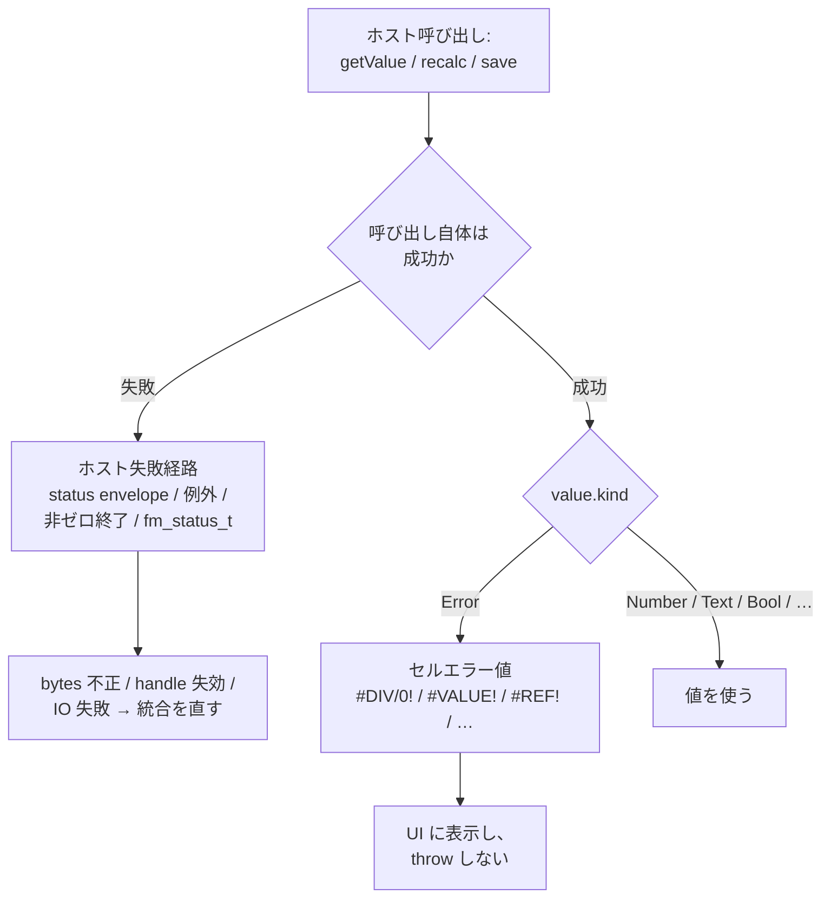

# エラーモデル

Spreadsheet error は **first-class value** です。`#DIV/0!` を返した数式はクラッシュしておらず、error 値を生成しただけです。それを取得したホスト API 呼び出しは成功しています。この区別はすべての binding で保たれます。

::: info 用語: セルエラーとホスト失敗
*セルエラー* は `kind = Error` の値であり、binding を通じてデータとして流れます。*ホスト失敗* はホスト操作自体の失敗（bytes 不正・ハンドル失効・IO エラー・engine 内部失敗）であり、別チャネル ─ `Status` envelope / 例外 / 非ゼロ終了 / `fm_status_t` ─ で報告されます。
:::



| Error | 意味 |
| --- | --- |
| `#DIV/0!` | 0 除算 |
| `#VALUE!` | 型または値の不一致 |
| `#REF!` | 無効な参照（削除されたシート、壊れた range） |
| `#NAME?` | 未知の名前または関数 |
| `#NUM!` | 数値オーバーフロー / 不正な数値 domain |
| `#N/A` | 値が利用できない |
| `#NULL!` | 範囲交差が空 |
| `#SPILL!` | 動的配列の spill 衝突 |
| `#CALC!` | engine が結果を返せない |
| `#GETTING_DATA` | 外部参照の取得中 |

binding はこれらを host exception に変換せず、値として保持してください（API 誤用・IO 失敗を報告する場合を除く）。

## ホスト側の失敗経路

| Surface | ホスト側の失敗経路 |
| --- | --- |
| WASM | `status.ok === false` または invalid workbook handle + `lastErrorMessage()` |
| Python | `FormulonError` |
| CLI | 非ゼロ終了コード + stderr 診断 |
| C ABI | 非ゼロ `fm_status_t` + `fm_last_error_message()` / `fm_last_error_context()` |
| MCP | 構造化 payload を持つ MCP エラー応答 |
| Native Node | 返却 envelope の `status.ok === false` |

## C ABI の値種別

| Kind | 意味 |
| --- | --- |
| `FM_VAL_BLANK` | 空セル |
| `FM_VAL_NUMBER` | IEEE-754 double |
| `FM_VAL_BOOL` | 真偽値 |
| `FM_VAL_TEXT` | UTF-8 のワークブック所有テキストビュー |
| `FM_VAL_ERROR` | Excel エラーコードの序数 |
| `FM_VAL_ARRAY` | 予約済み payload |
| `FM_VAL_REF` | 予約済み payload |
| `FM_VAL_LAMBDA` | 予約済み payload |

## 処理パターン

```ts
const value = wb.getValue(0, 0, 0)
if (value.kind === ValueKind.Error) {
  // セルエラー ─ UI 上で示すだけ。throw しない
  showInline(value.errorText)
} else if (value.kind === ValueKind.Number) {
  consume(value.number)
}
```

```python
v = wb.get_value(0, 0, 0)
if v.kind is ValueKind.ERROR:
    show_inline(v.error_text)
elif v.kind is ValueKind.NUMBER:
    consume(v.number)
```

## 次に読むもの

- [数式エンジン](/ja/workbook/formula-engine) ─ error の伝播
- [トラブルシュート](/ja/start/troubleshooting) ─ よくあるホスト失敗
