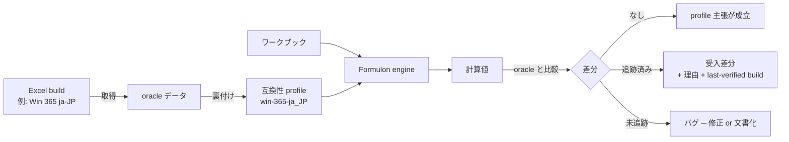

# 互換性モデル

Formulon は互換性を *測定可能な性質* として扱います。一般的な「Excel-compatible」を主張するのではなく、oracle データに裏付けられた **名前付き profile** に対する互換性を主張します。やるべきことは 2 つに分かれます ─ profile ごとの oracle データ取得と、受け入れ済み差分の明示。

::: info 用語: measured compatibility（測定可能な互換性）
profile と、それを裏付ける oracle データ群を指して行う互換性主張のこと。「`win-365-ja_JP` と互換」は *その Excel で実際に動かして値を取得した* ことを意味します。profile を指定しない「Excel-compatible」という言い回しは意図的に避けます。
:::

## profile

主要 profile は `win-365-ja_JP`。データが揃っている範囲で Mac Excel 365 ja-JP も追跡します。英語ロケール profile は、対応する oracle coverage を備えるまで公開しません。

公開リストと pin の運用は [ロケールプロファイル](/ja/compatibility/locale-profiles)。

## 差分（divergences）

避けられない差分があります。

- プラットフォーム間の浮動小数ドリフト
- volatile snapshot の不一致
- 未文書の Excel 挙動で、build をまたぐと契約が安定しないもの
- Excel 通りに揃えると engine の予測可能性が落ちる corner case の意図的な是正（暗黙オーバーフロー・暗黙型変換など）

受け入れ済み差分は理由と *last-verified Excel build* を付けて記録し、将来 Excel 側で挙動が変わっても判断可能にします。

## 運用ルール

| 立場 | やること |
| --- | --- |
| Formulon を使うアプリ | 計算に使った profile を永続化する |
| テスト | 期待する profile と Formulon バージョンを明示する |
| ドキュメント | profile 未指定の「Excel-compatible」という雑な主張は避ける |
| Issue 報告 | profile、Formulon バージョン、oracle の Excel build、最小再現ワークブックを含める |

## 次に読むもの

- [ロケールプロファイル](/ja/compatibility/locale-profiles) ─ profile カタログ
- [Oracle テスト](/ja/compatibility/oracle-testing) ─ profile をどう検証するか
- [Non-goals](/ja/compatibility/non-goals) ─ 互換性が意図的にカバーしない範囲
