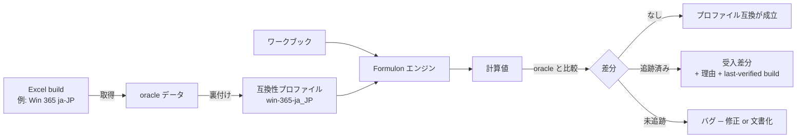

# 互換性モデル

Formulon は互換性を *測定可能な性質* として扱います。一般的な「Excel-compatible」と広く言い切るのではなく、Oracle データに裏付けられた **名前付きプロファイル** に対する互換性として説明します。やるべきことは 2 つに分かれます。プロファイルごとの Oracle データ取得と、受け入れ済み差分の明示です。

::: info 用語: measured compatibility（測定可能な互換性）
プロファイルと、それを裏付ける Oracle データ群を指す互換性の説明です。「`win-365-ja_JP` と互換」は *その Excel で実際に動かして値を取得した* ことを意味します。プロファイルを指定しない「Excel-compatible」という言い回しは意図的に避けます。
:::

## プロファイル

主要プロファイルは `win-365-ja_JP` です。データが揃っている範囲で Mac Excel 365 ja-JP も追跡します。英語ロケールのプロファイルは、対応する Oracle 検証データを備えるまで公開しません。

公開リストと固定方法は [ロケールプロファイル](/ja/compatibility/locale-profiles) を参照してください。

## 差分（divergences）

避けられない差分があります。

- プラットフォーム間の浮動小数ドリフト
- volatile snapshot の不一致
- 未文書の Excel 挙動で、ビルドをまたぐと安定しないもの
- Excel 通りに揃えるとエンジンの予測可能性が落ちる境界ケースの意図的な是正（暗黙オーバーフロー・暗黙型変換など）

受け入れ済み差分は理由と *last-verified Excel build* を付けて記録し、将来 Excel 側で挙動が変わっても判断可能にします。

## 運用ルール

| 立場 | やること |
| --- | --- |
| Formulon を使うアプリ | 計算に使ったプロファイルを永続化する |
| テスト | 期待するプロファイルと Formulon バージョンを明示する |
| ドキュメント | プロファイル未指定の「Excel-compatible」という曖昧な表現は避ける |
| Issue 報告 | プロファイル、Formulon バージョン、Oracle の Excel ビルド、最小再現ワークブックを含める |

## 次に読むもの

- [ロケールプロファイル](/ja/compatibility/locale-profiles) ─ プロファイル一覧
- [Oracle テスト](/ja/compatibility/oracle-testing) ─ プロファイルをどう検証するか
- [Non-goals](/ja/compatibility/non-goals) ─ 互換性が意図的にカバーしない範囲
