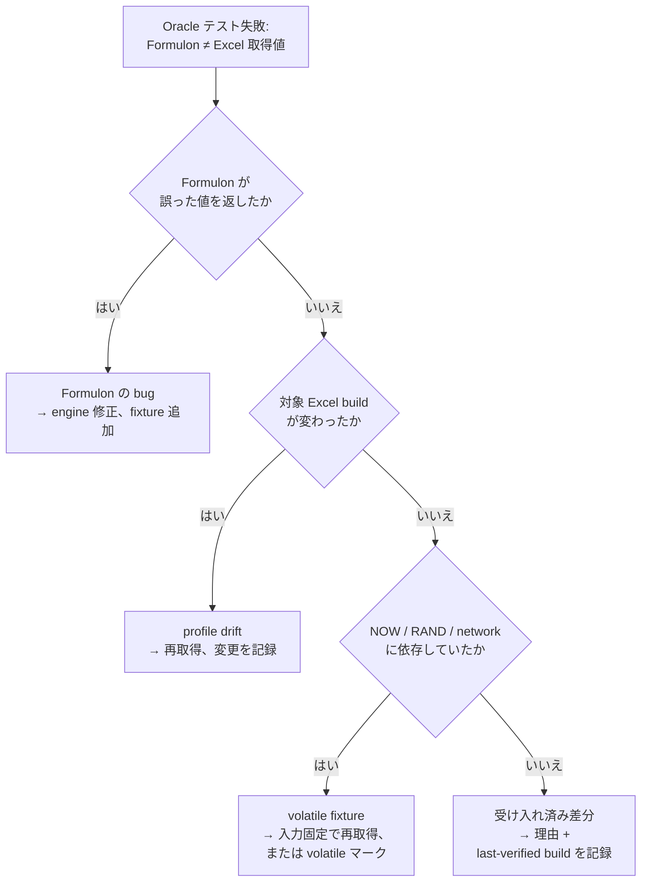

# Oracle テスト

Oracle テストは、実 Excel build から取得した値と Formulon の値を比較するものです。互換性の主張に対する実証層 ─ ドキュメントが言っていることではなく、対象ワークブック・ロケールで *Excel が実際に何を返すか* を基準にします。

::: info 用語: oracle データ
既知のワークブック・profile・build に対して Excel が返した値を取得したもの。テストはそのワークブックを Formulon で再計算し、取得済み値と比較します。食い違ったときは *Excel* が正です。
:::

::: info 用語: 受け入れ済み差分（accepted divergence）
Formulon が意図的に Excel と違う挙動をするケース。理由（セキュリティ、決定論的挙動、Excel 側の bug 修正など）と last-verified Excel build とともに記録されます。「Excel-like」とぼかさず、明示的に管理します。
:::

## なぜ oracle データが必要か

スプレッドシートの挙動には未文書の細部 ─ 丸め境界・`TEXT()` のロケール固有桁・`DATEVALUE()` の 2 桁年処理・空値の coercion・merge セルと spill 衝突の相互作用 ─ が多数あります。oracle fixture はそれらを review 可能なデータに固定し、回帰をデプロイ前（PR 時点）に検出できます。

## 失敗をどう読むか

通常、失敗は次のいずれかです。

| 種類 | 意味 | 典型的な対応 |
| --- | --- | --- |
| Formulon の bug | engine が誤った値を返した | engine を修正し、回帰用 fixture を追加 |
| profile drift | 対象 Excel build が変わった | oracle データを再取得し、変更を記録 |
| volatile な fixture | 取得時に `NOW` / `RAND` / network を含んでいた | 入力を制御して取り直す、または volatile マーク |
| 受け入れ済み差分 | 意図的に Excel と異なる | divergence リストに理由 + last-verified build を記録 |

## データの提供

各自の Excel 環境で oracle capture flow を実行することで、ロケール coverage が増えていきます。同じワークブックを `win-365-ja_JP`・`mac-365-ja_JP` ほか複数の profile で取得すれば、engine が検証できる範囲が広がります。capture flow は [Oracle 提供](/ja/development/oracle-contribution) を参照。

## 次に読むもの

- [互換性モデル](/ja/compatibility/model) ─ profile・divergence・運用ルール
- [ロケールプロファイル](/ja/compatibility/locale-profiles) ─ 現在の profile
- [Oracle 提供](/ja/development/oracle-contribution) ─ データ追加の流れ
