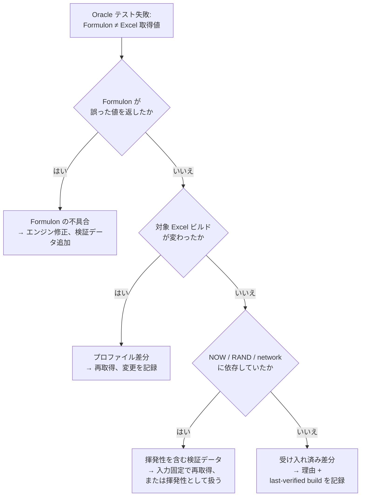

# Oracle テスト

Oracle テストは、実際の Excel から取得した値と Formulon の値を比較するものです。互換性の根拠になる実証層であり、ドキュメント上の仕様ではなく、対象ワークブックとロケールで *Excel が実際に何を返すか* を基準にします。

::: info 用語: oracle データ
既知のワークブック・プロファイル・Excel ビルドに対して、Excel が返した値を取得したもの。テストはそのワークブックを Formulon で再計算し、取得済み値と比較します。食い違ったときは *Excel* を正とします。
:::

::: info 用語: 受け入れ済み差分（accepted divergence）
Formulon が意図的に Excel と違う挙動をするケースです。理由（セキュリティ、決定論的な挙動、Excel 側の不具合修正など）と、最後に確認した Excel ビルドを記録します。「Excel 風」とぼかさず、明示的に管理します。
:::

## なぜ oracle データが必要か

スプレッドシートの挙動には、丸め境界、`TEXT()` のロケール固有の桁表現、`DATEVALUE()` の 2 桁年処理、空値の型変換、結合セルとスピル衝突の相互作用など、未文書の細部が多数あります。Oracle 検証データはそれらをレビュー可能な形に固定し、回帰をデプロイ前、つまり PR の時点で検出できるようにします。

## 失敗をどう読むか

通常、失敗は次のいずれかです。

| 種類 | 意味 | 典型的な対応 |
| --- | --- | --- |
| Formulon の不具合 | エンジンが誤った値を返した | エンジンを修正し、回帰用の検証データを追加 |
| プロファイル差分 | 対象 Excel ビルドが変わった | Oracle データを再取得し、変更を記録 |
| 揮発性を含む検証データ | 取得時に `NOW` / `RAND` / ネットワーク依存を含んでいた | 入力を制御して取り直す、または揮発性として扱う |
| 受け入れ済み差分 | 意図的に Excel と異なる | 差分リストに理由と最後に確認した Excel ビルドを記録 |

## データの提供

各自の Excel 環境で Oracle データ取得フローを実行すると、検証できるロケールが増えていきます。同じワークブックを `win-365-ja_JP`、`mac-365-ja_JP` など複数のプロファイルで取得すれば、エンジンが検証できる範囲も広がります。取得フローは [Oracle データの提供](/ja/development/oracle-contribution) を参照してください。

v0.9.2 では、Windows Excel ブリッジを通じたピボットテーブルと印刷ページ分割のワークブック Oracle 検証を追加しました。主要プロファイルは `win-365-ja_JP` です。Mac と Windows の取得結果は共通の比較器で扱うようになり、プラットフォーム差分を別々のテスト出力として埋もれさせずに確認できます。

## 次に読むもの

- [互換性モデル](/ja/compatibility/model) ─ プロファイル、差分、運用ルール
- [ロケールプロファイル](/ja/compatibility/locale-profiles) ─ 現在のプロファイル
- [Oracle データの提供](/ja/development/oracle-contribution) ─ データ追加の流れ
