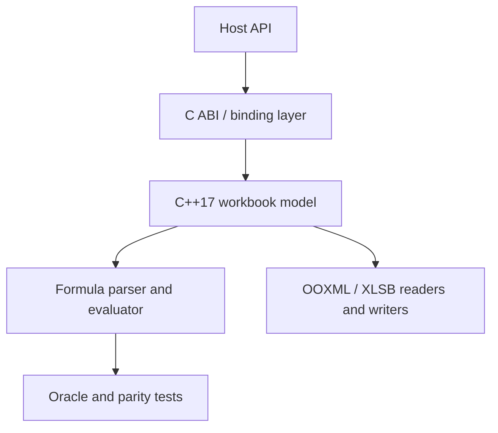

# アーキテクチャ

Formulon は 1 つの計算 core と、その周りを薄く包むパッケージング層で構成されています。WASM / Native Node / Python / CLI / MCP / `formulon-cell` のいずれも、同じ C++17 core を C ABI 経由で利用します。

::: info 用語: C ABI 層
C++ 以外のホストに workbook モデル・評価器・IO を公開するフラットな C 関数インタフェース。安定境界はここだけで、binding はこれを呼び、実装は core 側にしかありません。詳しくは [バインディング](/ja/development/bindings)。
:::

::: info 用語: workbook モデル
開かれたワークブックを表すメモリ上の表現 ─ sheets / cells / styles / defined name / table / 依存関係グラフ / dirty 集合 / profile / 再計算に必要な engine 状態。binding はパース後の bytes ではなくこのモデルへのハンドルを保持します。
:::

## どこに何があるか

| 層 | 所有 |
| --- | --- |
| Host API | 言語別 surface（JS / Python / CLI / MCP ツール / cell UI） |
| C ABI / binding | ライフタイム管理、ホスト値 ↔ engine 値の変換 |
| Workbook モデル | sheet / cell / style / 依存関係グラフ / dirty 状態 / profile |
| Parser / Evaluator | 関数カタログ、tree-walker、bytecode VM、error 伝播 |
| ファイル形式層 | OOXML / XLSB の reader / writer、passthrough 保持 |
| Oracle / parity テスト | Excel 由来の参照値、surface 間の一致 |

core は workbook 状態・数式の意味論・ファイルパース・依存追跡・再計算を所有します。binding はホスト値変換とライフタイム管理を担い、計算挙動には関与しません。

## なぜ分けるか

- **決定論的**: 計算源が 1 つなので、同じ profile で全 surface が同じ値を返す。
- **組み込み**: core は Node / Python / ブラウザの前提を持たないため、同じバイナリが 3 環境すべてを支えられる。
- **テスト**: oracle データは engine そのものと突き合わせる ─ 各 binding を別々に検証する必要がない。

## 次に読むもの

- [C++ core](/ja/development/core) ─ 計算 core 内部の規約
- [バインディング](/ja/development/bindings) ─ 担当 / 担当外
- [ソースからビルド](/ja/development/build-from-source) ─ 成果物の作り方
