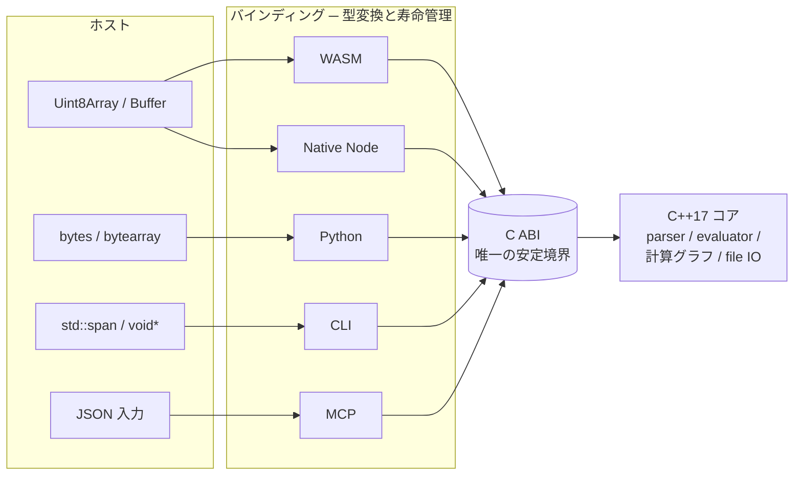

# バインディング

バインディングはホスト環境にワークブック操作を公開し、計算はコアに残します。それぞれのバインディングは片側でホスト言語の慣用、もう片側で C ABI を扱います。

::: info 用語: binding（バインディング）
ホスト型（`Uint8Array` / `bytes` / `bytearray` / `std::span` など）をエンジン入力に、エンジン出力をホスト型に変換する薄い層です。バインディングは数式の意味論を実装せず、データの形を整え、ライフタイムを管理します。
:::

## 担当すること

- ホストのバッファを C ABI が受け取れるワークブックバイトに変換する。
- ワークブックハンドルとライフタイムを管理する（WASM の `delete()`、Python の context manager、Native Node の GC 紐付け、CLI / MCP のプロセス寿命）。
- スプレッドシート値をホスト値に変換し、`ValueKind` を保つ（セルエラーが例外ではなく値であり続けるように）。
- 計算エラーと IO エラーを公開する（スプレッドシート error 値を失わない形で）。
- 各ホスト用の [API](/ja/api/) を公開する。

## 担当しないこと

バインディングは次のことを **しません**。

- 数式の意味論を実装する（パーサ / 評価器はコア）
- ワークブックのパースを重複実装する（OOXML / XLSB のリーダーはコア）
- プロファイル固有挙動を追加する（プロファイルはワークブック状態であり、C ABI 経由で設定される）
- 独自の dirty 集合・依存関係グラフ・再計算スケジューラを導入する（すべてコア側）

::: warning binding で Excel を再実装しないこと
ある関数結果を特別扱いしたい、ある値をコアと違う形で変換したい。そう思ったら正解はコア側にあります。評価器にケースを追加し、Oracle 検証データを追加すれば、全バインディングが同時にその挙動を取り込めます。バインディングごとに修正するとずれが早く広がります。
:::

## 実例

| バインディング | 扱うホスト慣用 | 触らない領域 |
| --- | --- | --- |
| WASM | `Uint8Array`、ステータスの包み、`ValueKind` enum、非同期モジュールファクトリ | 関数意味論・ファイルパース・計算グラフ |
| Native Node | N-API `Buffer`、同期 API、GC 紐付けハンドル | 関数意味論・ファイルパース・計算グラフ |
| Python | `bytes`、context manager、`FormulonError`、`Value.to_python()` | 関数意味論・ファイルパース・計算グラフ |
| CLI | `argv`、stdin / stdout / stderr、終了コード | 関数意味論・ファイルパース・計算グラフ |
| MCP | JSON 入出力、セッションマップ、許可リストに基づく呼び出し | 関数意味論・ファイルパース・計算グラフ |

## 次に読むもの

- [アーキテクチャ](/ja/development/architecture) ─ バインディング層の位置
- [C++ コア](/ja/development/core) ─ バインディングが呼ぶ対象
- [API 一覧](/ja/api/surfaces) ─ 各バインディングが現在公開している範囲
