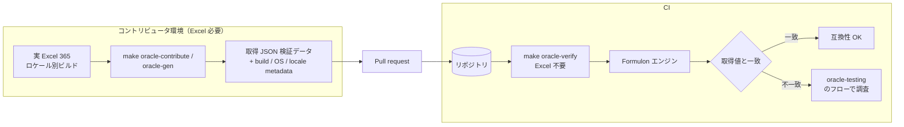

# Oracle 提供

Oracle データは検証済み互換性を広げる主な手段です。生成は実 Excel を駆動し、検証はコミット済み JSON を読むだけで CI でも安全に走らせられます。

::: info 用語: Oracle データの生成と検証
生成は実 Excel に対して取得ツールを走らせ、JSON 検証データを書き出す処理です。Excel を持つコントリビュータのマシンでだけ実行されます。検証はそのコミット済み JSON と Formulon 出力を比較する処理です。Excel は不要で CI でも安全です。
:::



## 提供フロー

1. 提供対象ロケールの Excel 365 を用意する。
2. リポジトリルートで `make oracle-contribute` を実行する。
3. 生成された検証データとメタデータを確認する。
4. データを乗せた pull request を出す。

各提供データには platform / Excel build / locale / profile identity を含めてください。後から検証データと Formulon が食い違ったときに、どの Excel build で取り直すべきかをメタデータから追えるようになります。

## ターゲット

ターゲット名は `<host>-<excel-major>-<locale>` の形式です（例: `mac-365-ja_JP` / `win-365-ja_JP`）。manifest は `tools/oracle/targets.yaml`。

現在募集中のロケールは英語・ドイツ語・フランス語・中国語・韓国語・タイ語の Excel 環境です。これらのターゲットを 1 つでも提供すると、推測ではなく実測のロケール挙動が増えます。

::: tip 提供範囲は完全でなくてよい
全関数を網羅する必要はありません。1 ロケール x 1 関数族（テキスト / 日付 / 検索など）の検証データでも、互換性カバレッジの意味のあるアップグレードになります。
:::

## コマンド

```sh
make oracle-setup
make oracle-contribute
make oracle-contribute TARGET=mac-365-en_US
make oracle-gen TARGET=win-365-ja_JP SUITE=count
make oracle-verify
```

`make oracle-verify` は CI で動きます。それ以外は Excel が必要で、コントリビュータのマシンでだけ実行します。

## レビュー観点

Oracle データ追加 PR は次の点でレビューされます。

- ターゲット名と manifest エントリが正しい
- Excel build / OS / locale のメタデータが記録されている
- 検証データが verifier の探索パス配下に置かれている
- スクリーンショットや入力サンプルに個人情報が混入していない

## 次に読むもの

- [互換性モデル](/ja/compatibility/model) ─ この作業が必要な理由
- [Oracle テスト](/ja/compatibility/oracle-testing) ─ データの使われ方
- [ロケールプロファイル](/ja/compatibility/locale-profiles) ─ 公開プロファイルカタログ
