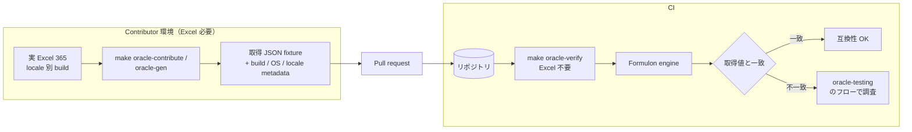

# Oracle 提供

oracle データは検証済み互換性を広げる主な手段です。生成（generation）は実 Excel を駆動し、検証（verification）はコミット済み JSON を読むだけで CI でも安全に走らせられます。

::: info 用語: oracle generation と verification の違い
*generation* は実 Excel に対して capture ツールを走らせて JSON fixture を書き出す処理。Excel を持つ contributor のマシンでだけ実行されます。*verification* はその committed JSON と Formulon 出力を比較する処理。Excel は不要で CI でも安全です。
:::



## 提供フロー

1. 提供対象 locale の Excel 365 を用意する。
2. リポジトリルートで `make oracle-contribute` を実行する。
3. 生成された fixture と metadata を確認する。
4. データを乗せた pull request を出す。

各 contribution には platform / Excel build / locale / profile identity を含めてください。後から fixture と Formulon が食い違ったときに、どの Excel build で取り直すべきかを metadata から追えるようになります。

## Target

target 名は `<host>-<excel-major>-<locale>` の形式です（例: `mac-365-ja_JP` / `win-365-ja_JP`）。manifest は `tools/oracle/targets.yaml`。

現在募集中のロケールは英語・ドイツ語・フランス語・中国語・韓国語・タイ語の Excel 環境です。これらの target を 1 つでも contribute すると、推測ではなく実測のロケール挙動が増えます。

::: tip 提供範囲は完全でなくてよい
全関数を網羅する必要はありません。1 ロケール × 1 関数族（テキスト / 日付 / 検索など）の fixture でも、互換性 coverage の意味のあるアップグレードになります。
:::

## コマンド

```sh
make oracle-setup
make oracle-contribute
make oracle-contribute TARGET=mac-365-en_US
make oracle-gen TARGET=win-365-ja_JP SUITE=count
make oracle-verify
```

`make oracle-verify` は CI で動きます。それ以外は Excel が必要で、contributor のマシンでだけ実行します。

## レビュー観点

oracle データ追加 PR は次の点で review されます。

- target 名と manifest エントリが正しい
- Excel build / OS / locale の metadata が記録されている
- fixture が verifier の探索パス配下に置かれている
- スクリーンショットや入力サンプルに個人情報が混入していない

## 次に読むもの

- [互換性モデル](/ja/compatibility/model) ─ この作業が必要な理由
- [Oracle テスト](/ja/compatibility/oracle-testing) ─ データの使われ方
- [ロケールプロファイル](/ja/compatibility/locale-profiles) ─ 公開 profile カタログ
