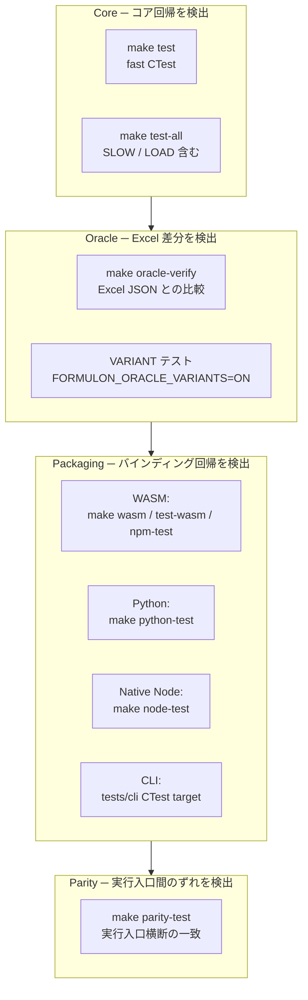

# テストマトリクス

テストの面は `make test` 1 つではありません。Formulon は 1 ソースツリーから複数パッケージを出荷するため、層（コア / Oracle データ / パッケージング / 実行入口間の整合性）ごとに異なる種類の回帰を捕えます。

::: info 用語: CTest labels
CTest はテストにテキストラベル（`SLOW` / `LOAD` / `VARIANT` など）を付け、ラベルで対象に含める / 除外する操作ができます。コミット前は遅いテストを除外し、CI ではそれらも回す、という運用が可能です。
:::



## Core テスト

```sh
make build
make test
make test-slow
make test-all
```

`make test` は `SLOW` と `LOAD` ラベルを除外します。`make test-all` は最も広い CTest セットです。コミット前に `make test`、コアを触る PR を出す前に `make test-all` を走らせます。

## Oracle テスト

```sh
make oracle-verify
```

Oracle 検証は Excel から取得済みの JSON と Formulon 出力を比較します。Excel を起動しないので CI でも安全です。

バリアント Oracle テストは明示的に有効化します。

```sh
cmake -B build -DFORMULON_ORACLE_VARIANTS=ON
cmake --build build --target formulon_oracle_variant_tests
cd build && ctest -L VARIANT --output-on-failure
```

プロファイル固有差分の調査や、新しいプロファイルを追加する前に使います。

## パッケージングのスモークテスト

| 実行入口 | コマンド |
| --- | --- |
| WASM | `make wasm`、`make test-wasm`、`make npm-test` |
| Python | `make python-test` |
| Native Node | `make node-test` |
| CLI | `tests/cli` 配下の CTest target |

各バインディングの `load → mutate → recalc → save` ループがコア変更後も成立することを確認します。

## 実行入口間の整合性

```sh
make parity-test
```

parity runner は利用可能な実行入口すべてで共有の検証用ワークブックを評価し、2 つ以上の実行入口が食い違ったら mismatch を報告します。未ビルドの実行入口は failure ではなく *missing* として扱われるので、Emscripten / Excel / 特定 toolchain を持たないマシンからも貢献できます。

::: tip parity と oracle の違いを 1 行で
parity = 自分たちの実行入口同士が一致している。Oracle テスト = 自分たちが Excel と一致している。リリース前には両方のシグナルが必要です。
:::

## 診断

| コマンド | 目的 |
| --- | --- |
| `RegistryCatalog.CoverageReport` | 正規カタログに対する実行時の関数登録状態 |
| `make behavior-status` | behavior vocabulary のステータス |
| `make coverage` | ローカルカバレッジ診断 |
| `make mutation` | ローカルミューテーションテスト診断 |

## 次に読むもの

- [ソースからビルド](/ja/development/build-from-source) ─ テスト対象のビルド方法
- [Oracle 提供](/ja/development/oracle-contribution) ─ `oracle-verify` が消費するデータ
- [リリースチェックリスト](/ja/development/release-checklist) ─ 各テストがリリース時いつ走るか
