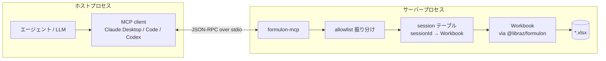

# formulon-mcp

`@libraz/formulon-mcp` は Formulon 用の stdio [MCP](https://modelcontextprotocol.io/) server です。AI エージェントが `.xlsx` ワークブックを開き、構造を調べ、セルやシートを編集し、式を再計算し、テキストを検索 / 置換し、結果を保存する ─ Excel もホスト統合コードも不要で、これらを制御された経路で行えます。

ファイルを単に要約させたいのではなく、**ワークブック自体をエージェントに操作させたい場合** に使います。

::: info 用語: MCP（Model Context Protocol）
AI エージェントに構造化されたツール・リソースを与えるためのオープンプロトコル。*server* が stdio または HTTP 上で型付きツール定義を公開し、*client*（Claude Desktop、Claude Code、Codex CLI など）が接続して、検証済みの入力でモデルにツールを呼ばせます。
:::

::: info 用語: stdio transport
最もシンプルな MCP 転送方式。client が server を子プロセスとして起動し、stdin / stdout 上で JSON-RPC を交わします。ネットワークもポートも開かず、OS のプロセス境界がそのままセキュリティ境界になります。
:::



## どこから読むか

| ページ | 読むタイミング |
| --- | --- |
| [インストール](/ja/mcp/install) | Claude Code / Claude Desktop / Codex CLI など stdio MCP クライアントに登録する |
| [ワークフロー](/ja/mcp/workflow) | session モデル・mutation パターン・recalc / save ループ |
| [Tools](/ja/mcp/tools) | カテゴリ別のツール詳細 |
| [セキュリティモデル](/ja/mcp/security) | allowlist、session 分離、server がすること / しないこと |

## パッケージ

MCP サーバーは `@libraz/formulon-mcp` として公開されており、内部で `@libraz/formulon@0.9.2` を使います。**Node.js 22 以上** が必要です。

```sh
npx -y @libraz/formulon-mcp
```

通常の利用ではリポジトリの clone は不要です。MCP client が `npx` 経由で公開パッケージを起動します。

## やらないこと

- チャット UI ではない。ツールサーバーである。
- 任意コードを走らせるサンドボックスではない。allowlist された `Workbook` メソッドだけが届く。
- ビューアではない。ブラウザ surface が必要なら [`formulon-cell`](/ja/cell/) を使う。

## 次に読むもの

- [インストール](/ja/mcp/install) ─ MCP クライアントと接続する
- [ワークフロー](/ja/mcp/workflow) ─ open / mutate / recalc / save の流れ
- [Tools](/ja/mcp/tools) ─ 各ツールの役割
