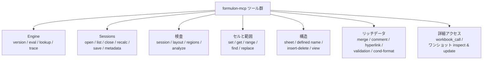

# Tools

`formulon-mcp` が公開する全ツールを、目的別にまとめます。モデルが MCP の tool discovery で受け取る説明と内容が一致するため、人間が surface を一望したいときに使えます。

::: info A1 と 0-based の併用
A1 表記を使う場合を除き、sheet / row / column インデックスは Formulon API と同じ 0-based です。アドレスを取るツールは両方の形式を受け付けます。
:::

## Engine

| Tool | 役割 |
| --- | --- |
| `formulon_version` | ロード済み Formulon engine のバージョンを返す。 |
| `formulon_eval_formula` | 使い捨てワークブックで Excel 数式を 1 つ評価。 |
| `formulon_function_lookup` | 登録済み関数を列挙、メタデータ / ローカライズ名を解決。 |
| `formulon_trace` | あるセルの precedents、dependents、または spill 情報を返す。 |

## Sessions

| Tool | 役割 |
| --- | --- |
| `formulon_open_workbook` | `.xlsx` パスを新しい session に読み込む。または既定ワークブックを作る。 |
| `formulon_list_sessions` | 開いている session を列挙。 |
| `formulon_close_workbook` | session を解放。 |
| `formulon_recalc_session` | 開いている session に対し再計算を発火。 |
| `formulon_save_session` | session を `.xlsx` に書き出す、または inline bytes で返す。 |
| `formulon_session_metadata` | session の関数名一覧や external link を読む。 |

## 検査

| Tool | 役割 |
| --- | --- |
| `formulon_inspect_session` | sheets、defined names、tables と、オプションで sparse cell entries を返す。 |
| `formulon_inspect_layout` | シートごとの layout：used range、merge、行・列 override、protection、セル、計算値、数式、style 詳細（オプション）。 |
| `formulon_detect_regions` | テーブル状の領域、label-value ペア、合計セルなどをルールベースの confidence と evidence 付きで検出。 |
| `formulon_analyze_workbook` | invoice / list / report / schedule / form などのワークブック形状を、決定論的な evidence で分類。 |

## セルと範囲

| Tool | 役割 |
| --- | --- |
| `formulon_set_cells` | session に mutation を適用。A1（`Sheet1!B2`）または 0-based（`sheet` / `row` / `col`）どちらも可。 |
| `formulon_get_cell` | 1 セルを読む。session でも、パス直接でも可。 |
| `formulon_get_range` | session から A1 矩形範囲を読む。 |
| `formulon_find_cells` | テキスト値・数式テキストを検索。 |
| `formulon_replace_cells` | 一致したテキスト値・数式テキストを置換。 |

## ワークブック構造

| Tool | 役割 |
| --- | --- |
| `formulon_sheet_operation` | シートの追加 / 削除 / 改名 / 移動。 |
| `formulon_set_defined_name` | workbook scope の defined name を追加 / 置換 / 削除。 |
| `formulon_edit_structure` | 行・列の挿入 / 削除。 |
| `formulon_set_sheet_view` | zoom、freeze pane、タブの hidden 状態を設定。 |

## リッチデータ

| Tool | 役割 |
| --- | --- |
| `formulon_merge_operation` | 結合範囲の一覧 / 追加 / 削除 / クリア。 |
| `formulon_comment_operation` | セルコメントの取得 / 設定 / 削除。 |
| `formulon_hyperlink_operation` | ハイパーリンクの一覧 / 追加 / 削除 / クリア。 |
| `formulon_validation_operation` | データ検証の一覧 / 追加 / 削除 / クリア。 |
| `formulon_conditional_format_operation` | 条件付き書式の一覧 / 追加 / 削除 / クリア / 評価。 |

## 詳細アクセス

| Tool | 役割 |
| --- | --- |
| `formulon_workbook_call` | allowlist 化された Formulon `Workbook` API への低レベルアクセス。 |
| `formulon_inspect_workbook` | パスからのワンショット要約。 |
| `formulon_update_workbook` | ワンショットの load / create → mutate → recalc → save。 |

::: warning `workbook_call` は allowlist で、任意ではない
`formulon_workbook_call` は server 側の allowlist に載っているメソッドだけを dispatch します（詳しくは [セキュリティモデル](/ja/mcp/security)）。allowlist 外は入力形によらず拒否されます。PivotTable / PivotCache・style・依存関係グラフ照会・関数メタデータ・spill 情報など、上位ツールがまだカバーしていない範囲のためにあります。
:::

## 次に読むもの

- [ワークフロー](/ja/mcp/workflow) ─ 基本ループ
- [セキュリティモデル](/ja/mcp/security) ─ server が拒否すること
