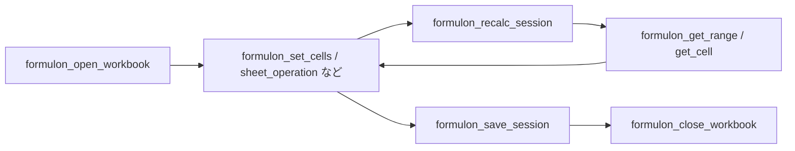

# ワークフロー

server は **session 指向** です。ワークブックを 1 度開き、`sessionId` に対して複数の操作を投げ、最後に保存して閉じます。これにより毎回ファイルを再パースする無駄が消え、数式評価の状態が一貫します。

::: info 用語: session
in-memory に開いたワークブックと engine 状態の組。`sessionId` 文字列をキーにします。session 同士は分離されており、別ファイル同士が cache・dirty 集合・依存関係グラフを共有することはありません。
:::



## 開く

```json
{
  "path": "input.xlsx",
  "sessionId": "work"
}
```

新規ワークブックを作りたい場合は `path` を省略すると、`Sheet1` だけを持つ既定ワークブックの session が返ります。

## セルを変更する

```json
{
  "sessionId": "work",
  "mutations": [
    { "type": "number",  "a1": "Sheet1!A1", "value": 41 },
    { "type": "formula", "a1": "Sheet1!B1", "formula": "=A1+1" }
  ],
  "recalc": true
}
```

`recalc: true` で mutation batch の末尾に再計算を走らせます。複数の `set_cells` をまとめてから 1 回だけ recalc したい場合は `false` にします。

::: tip A1 か 0-based か、どちらかに揃える
各 mutation は `a1: "Sheet1!B2"` でも、`sheet` / `row` / `col` の整数（0-based）でも書けます。整数形は Formulon API と一致します。ワークフローごとにスタイルを統一すると、エージェント出力が読みやすくなります。
:::

## 読む

```json
{
  "sessionId": "work",
  "range": "Sheet1!A1:B1"
}
```

矩形の値を kind 付きで返します。1 セルだけ読みたい場合は `formulon_get_cell` を使います。

## 明示的に再計算する

`recalc: true` を付けずに mutation を投げた場合、依存セルを読む前に `formulon_recalc_session` を 1 回呼びます。

```json
{ "sessionId": "work" }
```

## 検索 / 置換

```json
{
  "sessionId": "work",
  "query": "budget",
  "target": "both",
  "matchCase": false
}
```

```json
{
  "sessionId": "work",
  "query": "budget",
  "replacement": "forecast",
  "target": "texts",
  "recalc": true
}
```

`target` は `texts` / `formulas` / `both`。数式参照のリファクタリングで、テキストセルを触らずに数式だけ書き換えたいときに有効です。

## 保存

```json
{
  "sessionId": "work",
  "outputPath": "output.xlsx"
}
```

`outputPath` を省略すると bytes を inline（base64）で返します。エージェントが結果をユーザーに直接戻すときに便利です。

## 閉じる

```json
{ "sessionId": "work" }
```

session の engine 状態を即座に解放します。server プロセス終了でも session は破棄されますが、長時間のエージェント実行では明示的に閉じる方が安く、可読性も高くなります。

## ワンショット便利系

サブシーケンスが不要なら、ループを 1 回でまとめるツールも用意されています。

| ツール | 効果 |
| --- | --- |
| `formulon_eval_formula` | 使い捨てワークブックで数式評価 |
| `formulon_inspect_workbook` | 開く → 要約 → 閉じる。session は残さない |
| `formulon_update_workbook` | load / create → mutate → recalc → save。session は残さない |

同じワークブックを何度も読み直す必要がないときに使います。

## 次に読むもの

- [Tools](/ja/mcp/tools) ─ カテゴリ別ツール一覧
- [セキュリティモデル](/ja/mcp/security) ─ 許可されること / されないこと
