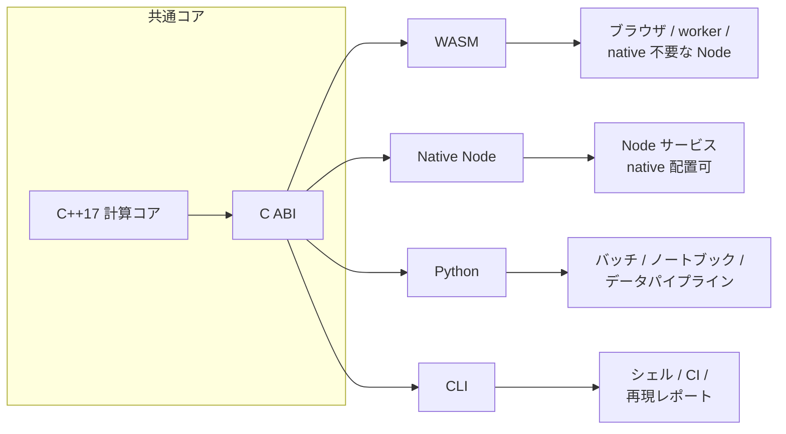

# 実行環境

Formulon は 1 つの計算コアを複数の実行環境から使えるようにします。数式の意味ではなく、どこに配置してどう動かすかで選びます。2 つの実行環境でワークブック結果が変わる場合、それは不具合か、文書化された互換性差分として扱います。

::: info 同じエンジン、異なる実行環境
WASM、Python、Native Node、CLI は計算結果を共有するべきです。変わるのはパッケージング、ファイルアクセス、メモリ所有権、起動コスト、エラーの受け渡しです。
:::

| 実行環境 | 選ぶ条件 |
| --- | --- |
| [WASM](/ja/runtimes/wasm) | ブラウザ、worker、ネイティブアドオン前提なしの Node |
| [Python](/ja/runtimes/python) | スクリプト、ノートブック、データパイプライン、一括再計算 |
| [Native Node](/ja/runtimes/node-native) | プラットフォーム別の `.node` アドオンを配置できる Node サービス |
| [CLI](/ja/runtimes/cli) | シェル処理、CI スナップショット、問題の再現 |
| [CI 回帰検査](/ja/runtimes/ci-regression) | 自動チェックでワークブック差分を取りたい場合 |

## 判断ルール

- ワークブックデータがブラウザにある、アップロード時の privacy が重要、サーバーに raw file を渡したくない場合は WASM。
- 帳票生成、定期ジョブ、データ検証、ノートブックなら Python。
- ネイティブ成果物を配置でき、WASM より低い起動コストが必要な Node サービスなら Native Node。
- 再現可能な issue report、CI スナップショット、単発の再計算チェックなら CLI。

## API の入口

詳細 API ページは top-level navigation から外し、この実行環境セクションにまとめます。

| API ページ | 目的 |
| --- | --- |
| [API 一覧](/ja/api/surfaces) | パッケージごとの役割とホスト側の責務を比較 |
| [WASM API](/ja/api/wasm) | ブラウザ / worker での使い方と lifetime 管理 |
| [Python API](/ja/api/python) | 一括再計算とワークブック検査 |
| [CLI リファレンス](/ja/api/cli) | シェル自動化と CI での利用 |

## ここで決めないこと

実行環境の選択だけでは Excel 互換性は保証できません。重要なワークブックで使う前に [互換性](/ja/compatibility/) を確認し、自分のファイルで検証してください。
