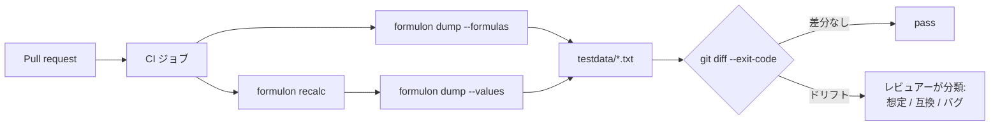

# CI でワークブックの回帰を検出

CLI を使い、ワークブックの変更をコードレビューで可視化するパターンです。手で Excel 編集されたワークブックはバイナリとして不透明ですが、Formulon にかけるとレビュアーが読める差分になります。

::: warning 揮発性数式に注意
`NOW` / `TODAY` / `RAND` / `RANDBETWEEN` を含むワークブックは値スナップショットに向きません。隔離、明文化、またはスナップショット対象外にしてください。
:::

::: info 用語: golden file
期待出力としてコミットされているファイル。テストは現在出力と比較し、ずれていれば fail します。レビュアーが意図的変更（golden 更新）か回帰（コード / ワークブックの修正）か判断します。
:::

## パイプラインの形



## Formula のドリフト

```sh
formulon dump --formulas model.xlsx > testdata/model.formulas.txt
git diff --exit-code testdata/model.formulas.txt
```

cached value に依存せず、ワークブックの数式編集を検知します。再計算しないので安価です。

## Value のドリフト

```sh
formulon recalc model.xlsx -o /tmp/model.recalc.xlsx --quiet
formulon dump --values /tmp/model.recalc.xlsx > testdata/model.values.txt
git diff --exit-code testdata/model.values.txt
```

計算値の変化を検知します。`dump --values` は事前に再計算するため、スナップショットは「ファイルにキャッシュされた値」ではなく「engine が実際に計算した値」を反映します。

## GitHub Actions 例

```yaml
name: workbook regression
on: [pull_request]
jobs:
  workbook:
    runs-on: ubuntu-latest
    steps:
      - uses: actions/checkout@v4
      - name: Install formulon CLI
        run: |
          curl -L -o formulon "https://github.com/libraz/formulon/releases/latest/download/formulon-cli-linux-x86_64"
          chmod +x formulon
          sudo mv formulon /usr/local/bin/
      - name: Snapshot formulas
        run: |
          formulon dump --formulas model.xlsx > testdata/model.formulas.txt
      - name: Snapshot values
        run: |
          formulon recalc model.xlsx -o /tmp/model.xlsx --quiet
          formulon dump --values /tmp/model.xlsx > testdata/model.values.txt
      - name: Fail on diff
        run: |
          git diff --exit-code testdata/
```

同じワークブック + profile + Formulon バージョンに対して結果は決定論的なので、fail するのはワークブックか engine が変わったときだけ ─ どちらもレビュー価値があります。

## レビュー方針

差分は次のいずれかに分類してください。

- 想定済みの数式編集
- 想定済みの入力変更
- Formulon の互換性差分
- Excel の挙動変化
- バグ

この分類を PR 本文（または commit trailer）に書き残すと、将来同じ差分を見た人が「なぜ受け入れたのか」を追跡できます。golden file が「ただの bin diff」になるのを防ぎます。

::: tip CI では Formulon バージョンを pin する
dump 出力フォーマットと値の意味はパッチリリース間で安定していますが、Formulon バージョン（または CLI バイナリ URL）を明示的に pin してください。無関係なリリースアップグレードがワークブック回帰として顕在化するのを避けられます。
:::

## 次に読むもの

- [CLI ワークフロー](/ja/runtimes/cli) ─ このシナリオの裏で動くコマンド
- [CI 回帰検査](/ja/runtimes/ci-regression) ─ より広いパターン
- [互換性モデル](/ja/compatibility/model) ─ profile を pin する理由
