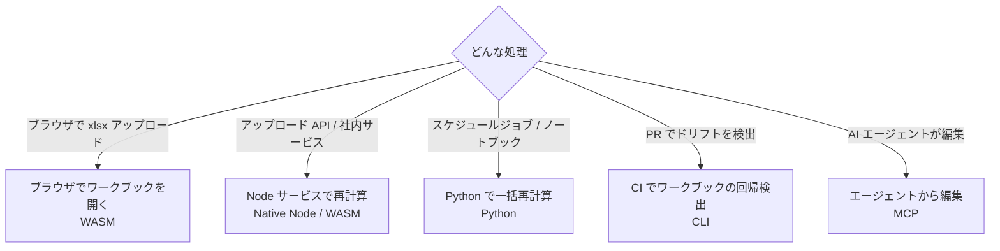

# 利用例

Formulon を具体的な処理の流れに組み込む例です。シナリオごとに別の実行環境を選んでいます。デプロイ先に近いものを選び、設定詳細は対応する [実行環境](/ja/runtimes/) ページを参照してください。

::: info 実ワークブックで早めに試す
1 つの数式が動くことを確認したら、代表的なワークブックを早めに通してみてください。スプレッドシートエンジンの成否は孤立した数式ではなく、ワークブック全体の構造で決まります。
:::

| 利用例 | 実行環境 | 目的 |
| --- | --- | --- |
| [ブラウザでワークブックを開く](/ja/scenarios/browser-upload) | WASM | `.xlsx` をサーバーに送らずブラウザ内で再計算 |
| [Node サービスで再計算](/ja/scenarios/node-service) | Native Node / WASM | アップロードまたは社内生成したワークブックを API の裏側で再計算 |
| [Python で一括再計算](/ja/scenarios/python-batch) | Python | ジョブやノートブックで帳票やモデルを再計算 |
| [CI でワークブックの回帰を検出](/ja/scenarios/ci-regression) | CLI | 自動チェックで数式や計算値のずれを検出 |
| [AI エージェントからワークブックを編集](/ja/mcp/) | MCP | `formulon-mcp` 経由でエージェントが `.xlsx` を開いて編集・再計算・保存 |

## シナリオ共通の構造

どのシナリオも [ワークブックの流れ](/ja/workbook/lifecycle) で説明している `load → mutate → recalc → save` を踏みます。違うのは:

- バイト列の出所（`File`、ファイルシステム、IO ストリーム、MCP ツール入力）
- バイト列の行き先（`save()` の戻り値、ファイル書き込み、返却 `bytes` フィールド）
- メモリと IO の所有者
- エラーがホスト境界をどう渡るか

## 互換性ゲート

どのシナリオでも、導入前にワークブック内の数式を確認し、外部サービス依存の関数をどう扱うか決めてください。Formulon がローカル実装しているのは、認識対象 522 件のうち **505 / 522** 件です。残りは環境依存または利用不可スタブで、`COPILOT`、`PY`、`IMAGE`、`WEBSERVICE`、`STOCKHISTORY`、`RTD`、CUBE 接続関数などが該当します。これらを含むワークブックは、拒否する、互換性警告を表示する、Excel 連携の別経路に回す、といったプロダクト上の判断が必要です。

実行環境ごとの設定は [実行環境](/ja/runtimes/)、エンジン側のフローは [ワークブックの流れ](/ja/workbook/lifecycle) を参照してください。
