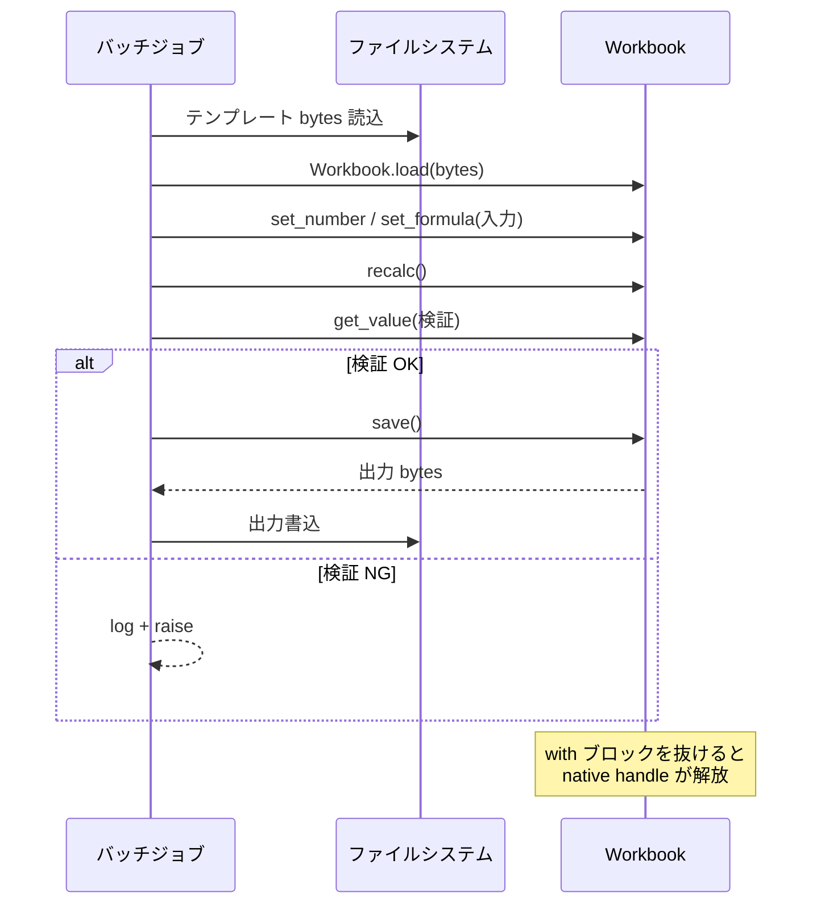

# Python で一括再計算

スケジュールジョブ、ノートブック、データパイプラインの一部としてスプレッドシート再計算を組み込むパターンです。ブラウザで動く engine と同じものを、ホスト言語だけ Python に置き換えて動かします。

::: tip ワークブック IO は端に寄せる
最初に bytes をロードし、明示的に変更 / recalc し、最後に bytes を書き出します。計算ロジックと無関係なデータロードを混ぜないこと。原因の切り分けとテストが楽になります。
:::

::: info 用語: scheduled job（スケジュールジョブ）
cron / Airflow / GitHub Actions / クラウドスケジューラなどから定期実行されるバッチ処理。1 つ以上の入力アーティファクトを消費して出力アーティファクトを生成する。ステートレスかつべき等な設計が運用しやすく、Formulon の `load → mutate → recalc → save` の形と相性が良い。
:::

## 流れ



## ジョブの例

```python
from pathlib import Path
from formulon import Workbook

def recalc_report(input_path: Path, output_path: Path, revenue: float) -> None:
    with Workbook.load(input_path.read_bytes()) as wb:
        wb.set_number(0, 3, 1, revenue)  # Sheet1 の B4
        wb.recalc()
        output_path.write_bytes(wb.save())

recalc_report(Path("template.xlsx"), Path("report.xlsx"), 125_000.0)
```

`with` ブロックを抜けるとネイティブハンドルが解放されます。内部で例外が出ても確実に走ります。

## 複数セルを変更する

```python
from formulon import Workbook, ValueKind

INPUTS = [
    (0, 3, 1, 125_000.0),   # B4: revenue
    (0, 4, 1,  80_000.0),   # B5: COGS
    (0, 5, 1,  12_000.0),   # B6: marketing
]

with Workbook.load(template_bytes) as wb:
    for sheet, row, col, value in INPUTS:
        wb.set_number(sheet, row, col, value)
    wb.recalc()

    margin = wb.get_value(0, 8, 1)  # B9: gross margin
    if margin.kind is ValueKind.NUMBER and margin.number < 0:
        raise RuntimeError(f"Negative margin: {margin.number}")

    output_path.write_bytes(wb.save())
```

`set_number` / `set_text` / `set_formula` が定番。座標は 0-based の `(sheet, row, col)` です。詳しくは [ワークブック操作](/ja/workbook/operations)。

## 互換性プロファイルを pin する

```python
with Workbook.load(template_bytes) as wb:
    wb.set_excel_profile_id('win-365-ja_JP')
    wb.recalc()
    ...
```

CI fixture や本番ジョブでは profile を明示し、ロケール依存結果を再現可能にしてください。詳しくは [ロケールプロファイル](/ja/compatibility/locale-profiles)。

## 検証パターン

リポジトリに小さな fixture ワークブックを置きます。

```sh
python jobs/recalc_reports.py
formulon dump --values report.xlsx > report.values.txt
git diff --exit-code report.values.txt
```

Python の入口と CLI の `dump --values` スナップショットを組にすると、コード変更とワークブック変更の両方を end-to-end で検知できます。

::: warning volatile な入力は要対処
`NOW` / `TODAY` / `RAND` / network 関数は非決定的です。golden snapshot に含めるなら、テンプレート側で固定値に置き換えるか、スナップショット範囲外に移動してください。
:::

## エラー処理

```python
from formulon import Workbook, FormulonError, ValueKind

try:
    with Workbook.load(blob) as wb:
        wb.recalc()
        value = wb.get_value(0, 0, 0)
        if value.kind is ValueKind.ERROR:
            # セルの Excel エラー ─ 例外にせずデータとして処理
            log.warning("cell error: %s", value.error_code)
except FormulonError as e:
    # ホスト失敗（bytes 不正・ハンドル失効・IO）
    log.error("formulon host failure: %s", e)
    raise
```

## 適合性の確認

| ワークフロー | 推奨 runtime |
| --- | --- |
| cron 駆動の夜間レポート | Python |
| Jupyter / Colab ノートブック | Python |
| ブラウザ内再計算 | WASM |
| 大規模スループットの Node サービス | Native Node |
| シェル駆動の CI スナップショット | CLI |

## 次に読むもの

- [Python API](/ja/api/python) ─ トップレベル surface
- [ワークブックの流れ](/ja/workbook/lifecycle) ─ スクリプトの裏で動く engine フロー
- [CI でワークブック回帰検査](/ja/scenarios/ci-regression) ─ Python とスナップショットの組み合わせ
