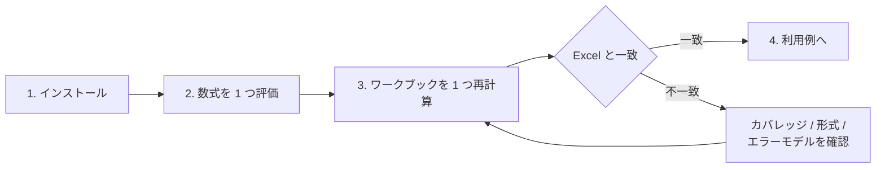

# はじめる

Formulon はヘッドレスなスプレッドシート計算エンジンです。まず小さな数式を動かし、その後に製品で使う実行環境に近い形で実ワークブックを試します。

::: tip 実 workbook から始める
Formulon を理解する最短ルートは、すでに使っているワークブックを 1 つ再計算することです。互換性ページは、Excel と結果が違うときに差分を理解するためにあります。
:::

## 推奨順序

1. 実行環境に合うパッケージをインストールする。
2. 1 つの数式を Formulon で動かす。
3. 1 つのワークブックを再計算する。
4. Excel と結果が違う場合は [数式カバレッジ](/ja/compatibility/formula-coverage)、[ファイル形式サポート](/ja/compatibility/file-format-support)、[エラーモデル](/ja/compatibility/errors) を確認する。
5. 具体的な [利用例](/ja/scenarios/) に進む。

## 最初のタスク

| タスク | ページ |
| --- | --- |
| パッケージを入れる | [インストール](/ja/start/install) |
| 1 つの数式を評価する | [数式を評価する](/ja/start/evaluate) |
| ワークブックを再計算する | [ワークブックを再計算する](/ja/start/recalculate) |
| WASM / Python / Native Node / CLI / C ABI を選ぶ | [実行環境を選ぶ](/ja/start/choose-runtime) |
| よくある組み込みエラーを直す | [トラブルシュート](/ja/start/troubleshooting) |
| 具体的な流れから始める | [利用例](/ja/scenarios/) |

## 次に読むもの

- 実行環境への組み込み: [WASM](/ja/runtimes/wasm), [Python](/ja/runtimes/python), [Native Node](/ja/runtimes/node-native), [CLI](/ja/runtimes/cli)
- ワークブックの挙動: [ライフサイクル](/ja/workbook/lifecycle), [数式エンジン](/ja/workbook/formula-engine), [再計算](/ja/workbook/recalculation)
- 互換性: [数式カバレッジ](/ja/compatibility/formula-coverage), [ファイル形式サポート](/ja/compatibility/file-format-support), [エラーモデル](/ja/compatibility/errors)
- API 詳細: [API 一覧](/ja/api/surfaces), [WASM API](/ja/api/wasm), [Python API](/ja/api/python), [CLI リファレンス](/ja/api/cli)
