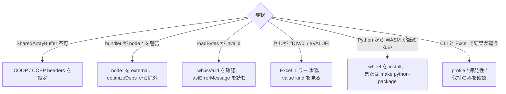

# トラブルシュート

よくある組み込み時の失敗を扱います。



## SharedArrayBuffer が使えない

cross-origin isolation headers を設定します。

```http
Cross-Origin-Opener-Policy: same-origin
Cross-Origin-Embedder-Policy: require-corp
```

::: tip 本番ホストで確認する
ローカル開発サーバーではなく、実際の CDN / アプリケーションサーバーで headers を確認してください。
:::

## Vite が `node:` imports を警告する

WASM package には Node 実行環境向けの分岐が含まれます。ブラウザ向け bundler では `node:module` や `node:worker_threads` の警告が出る場合があります。

```ts
export default defineConfig({
  optimizeDeps: { exclude: ['@libraz/formulon'] },
  build: {
    target: 'es2022',
    rollupOptions: { external: [/^node:/] }
  }
})
```

## ワークブック読み込みが invalid handle を返す

WASM では `loadBytes(bytes)` の直後に `wb.isValid()` を確認し、`Module.lastErrorMessage()` を読みます。

## 数式が Excel エラーを返す

Excel エラーは値です。`#DIV/0!`、`#VALUE!`、`#NAME?` はホスト API の失敗ではありません。

## Python が WASM runtime を読み込めない

公開 wheel を install して pip に互換性のある `wasmtime` wheel を解決させるか、
repository root で staging します。

```sh
make python-package
```

source tree から import する場合は、C ABI WASM module が
`packages/python/formulon/_wasm/` に stage されている必要があります。

## CLI の結果が Excel と違う

まず次を確認してください。

- `PY` や CUBE 接続関数など、外部サービスがないため Excel エラーを返す関数か。
- `win-365-ja_JP` 外のロケール挙動に依存していないか。
- 揮発性関数が絡んでいないか。
- 保持はされるが評価対象ではないワークブック構造に依存していないか。

最小の数式ケースを作り、[数式カバレッジ](/ja/compatibility/formula-coverage) と [Oracle テスト](/ja/compatibility/oracle-testing) を確認してください。
