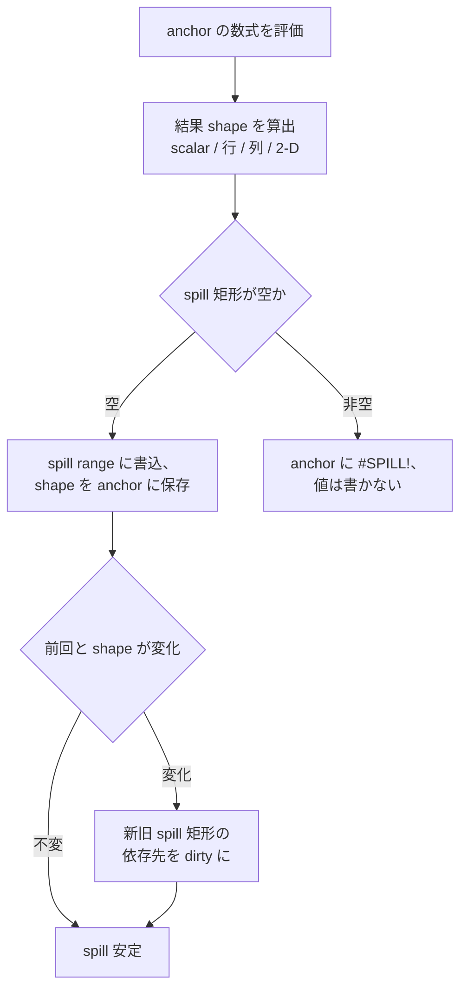

# 動的配列

動的配列は、1 つの数式が複数の値を返し、その結果が周辺セルに *spill*（こぼれ出し）する仕組みです。数式テキストを保持する anchor cell と、計算結果が射影される spill range の組で表現します。Formulon は spill の shape、依存関係、衝突挙動を再計算の一部として管理します。

::: info 用語: spill / spill range
動的配列数式が複数の値を返したときに広がる矩形領域のこと。左上のセル（anchor）が数式テキストを持ち、それ以外のセルは結果の読み取り専用射影になります。
:::

::: info 用語: anchor cell
動的配列数式の本体を保持するセル。anchor を編集または消去すると spill 全体が変化します。spill 内の非 anchor セルは直接編集できず、消去操作は anchor が変わるまで no-op です。
:::

## 挙動の概要

- spill range は数式結果の shape（scalar / 行 / 列 / 2 次元配列）から決まる。
- shape が変わる数式は依存セルを dirty にし、それらの spill anchor を再計算する。
- spill 範囲が非空セルを上書きしそうな場合は `#SPILL!` を返し、データを黙って上書きすることはない。
- 暗黙的 broadcasting で次元が合わない場合（例: 3 行と 5 行を混在）は、関数族ごとの Excel error 規則に従う。



## spill する関数の例

```text
=SEQUENCE(5)
=UNIQUE(A1:A100)
=SORT(A1:B20, 2, -1)
=FILTER(A1:C50, B1:B50 > 0)
=LET(x, A1:A10, x * 2)
```

動的配列以前の Excel で書かれたワークブックとの後方互換のため、暗黙交差 (`@`) も引き続きサポートします。

## 再計算との連携

再計算 engine は anchor ごとに以下の spill メタデータを保持します。

| フィールド | 用途 |
| --- | --- |
| anchor address | 数式本体の sheet / row / column |
| 結果 shape | 直近の成功時の行数 × 列数 |
| spill error | spill が成立しなかった場合の `#SPILL!`、それ以外は null |
| range の依存元 | spill 内のいずれかのアドレスを参照しているセル |

shape が変わると、旧 spill 矩形・新 spill 矩形いずれかにかかるすべての依存セルが dirty 化されます。

::: tip spill 状態の検査
WASM / Native Node は `spillInfo(sheet, row, col)` を公開しています。MCP の `formulon_trace` ツールは session から precedent / dependent / spill 情報を読み取れます。`#SPILL!` の原因となるセルを特定したいときに有効です。
:::

## 互換性の注意

動的配列の挙動はワークブック単位のフラグや、同じシート内に旧来の CSE 配列が混在しているかどうかにも依存します。混在ワークブックを扱うときは、結果を信頼する前に oracle fixture と突き合わせてください。

## 次に読むもの

- [再計算](/ja/workbook/recalculation) ─ dirty セルと spill shape の関係
- [数式カバレッジ](/ja/compatibility/formula-coverage) ─ 配列対応関数の登録状況
- [エラーモデル](/ja/compatibility/errors) ─ `#SPILL!` とホスト失敗の違い
