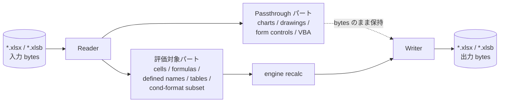

# ファイル形式

Formulon は modern な Office Open XML 系・バイナリ系のスプレッドシート形式を中心にサポートします。各 reader / writer の背後には同じ計算 core があるため、形式層が担うのは shape の保持と機能のマッピングであり、計算挙動は形式によって変わりません。

::: info 用語: OOXML
Office Open XML（ISO/IEC 29500）。`.xlsx` / `.xlsm` / `.xltx` などの ZIP コンテナ形式で、内部は workbook / sheets / styles / shared strings / relationships などの XML パートで構成されます。
:::

::: info 用語: passthrough part
Formulon が「意味的には所有しないが、保存時に消えないように構造だけ保持する」パート。engine が評価しない機能でも、再計算の往復でバイト列が消失しません。
:::

## XLSX

OOXML reader / writer は以下を扱います。

- workbook parts と relationships
- worksheets（セル、数式、cached value）
- styles、number formats、fonts、fills、borders、themes
- shared strings
- tables、defined names
- comments / threaded comments
- hyperlinks
- merges
- data validations
- conditional formatting
- pivot tables / pivot caches（layout レベルの subset）
- external links
- protection metadata
- sheet view、freeze panes、hidden tabs
- 行・列単位の override

::: tip cached value の扱い
読み込み時、数式セルは数式テキストとファイル内の cached value の両方を保持します。`recalc()` 後、cached value は engine の計算結果で置き換わり、保存時に「数式と値が整合した」ファイルが書き出されます。
:::

## XLSB

MS-XLSB の読み書きを必要とするワークフローのために、同じ計算 model を維持したまま使える binary path を用意しています。書き出し時にサポートされる feature 集合は XLSX writer の subset で、セル・シート・styles・defined name・table が中心です。

## 保持と評価の対応

| 機能 | 読み込み | 再計算 | 書き出し |
| --- | --- | --- | --- |
| セル内の数式 | yes | yes | yes |
| Styles / number formats | yes | n/a | yes |
| Defined names / tables | yes | yes（参照として解決） | yes |
| 条件付き書式 | yes | partial（評価対象 subset） | yes |
| Pivot tables | layout / cache（subset） | no | yes |
| Chart | パートを保持 | no | yes |
| Form controls / drawings | passthrough | no | yes |
| VBA project | passthrough | 実行しない | yes |

::: warning VBA は保持するが実行はしない
VBA を含むワークブックは round-trip 可能ですが、マクロは決して実行されません。マクロ側の状態に依存する計算は Excel と差分が出ます。
:::

## 非対応

- 旧 `.xls`（BIFF）の読み書き
- CSV はシンプルな取り込みのみ。Excel CSV の引用符の細かな境界には対応しない
- ライブ external connections（PowerQuery / OLE DB / Web）

## 次に読むもの

- [ライフサイクル](/ja/workbook/lifecycle) ─ bytes からワークブック model への変換
- [ワークブック操作](/ja/workbook/operations) ─ sheet / cell / 構造の編集
- [互換性 / ファイル形式サポート](/ja/compatibility/file-format-support) ─ read / write / preserve の対応表
