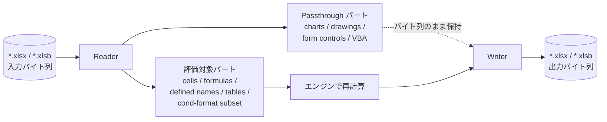

# ファイル形式

Formulon は現代的な Office Open XML 系・バイナリ系のスプレッドシート形式を中心にサポートします。各リーダー / ライターの背後には同じ計算コアがあるため、形式層が担うのは構造の保持と機能のマッピングであり、計算挙動は形式によって変わりません。

::: info 用語: OOXML
Office Open XML（ISO/IEC 29500）。`.xlsx` / `.xlsm` / `.xltx` などの ZIP コンテナ形式で、内部は workbook / sheets / styles / shared strings / relationships などの XML パートで構成されます。
:::

::: info 用語: passthrough part
Formulon が「意味的には所有しないが、保存時に消えないように構造だけ保持する」パートです。エンジンが評価しない機能でも、再計算して保存し直す間にバイト列が消失しません。
:::

## XLSX

OOXML reader / writer は以下を扱います。

- workbook パートと relationships
- worksheets（セル、数式、キャッシュ値）
- styles、number formats、fonts、fills、borders、themes
- shared strings
- tables、defined names
- comments / threaded comments
- hyperlinks
- merges
- data validations
- conditional formatting
- pivot tables / pivot caches（レイアウトレベルの部分対応）
- external links
- protection metadata
- sheet view、freeze panes、hidden tabs
- 行・列単位の上書き設定

::: tip キャッシュ値の扱い
読み込み時、数式セルは数式テキストとファイル内のキャッシュ値の両方を保持します。`recalc()` 後、キャッシュ値はエンジンの計算結果で置き換わり、保存時に「数式と値が整合した」ファイルが書き出されます。
:::

## XLSB

MS-XLSB の読み書きを必要とするワークフローのために、同じ計算モデルを維持したまま使えるバイナリ形式の経路を用意しています。書き出し時にサポートされる機能集合は XLSX ライターの一部で、セル・シート・styles・defined name・table が中心です。

## 保持と評価の対応

| 機能 | 読み込み | 再計算 | 書き出し |
| --- | --- | --- | --- |
| セル内の数式 | yes | yes | yes |
| Styles / number formats | yes | n/a | yes |
| Defined names / tables | yes | yes（参照として解決） | yes |
| 条件付き書式 | yes | partial（評価対象 subset） | yes |
| Pivot tables | layout / cache（subset） | no | yes |
| Chart | パートを保持 | no | yes |
| Form controls / drawings | passthrough | no | yes |
| VBA project | passthrough | 実行しない | yes |

::: warning VBA は保持するが実行はしない
VBA を含むワークブックは読み込み後に保存し直せますが、マクロは決して実行されません。マクロ側の状態に依存する計算は Excel と差分が出ます。
:::

## 非対応

- 旧 `.xls`（BIFF）の読み書き
- CSV はシンプルな取り込みのみ。Excel CSV の引用符の細かな境界には対応しない
- ライブ外部接続（PowerQuery / OLE DB / Web）

## 次に読むもの

- [ライフサイクル](/ja/workbook/lifecycle) ─ バイト列からワークブックモデルへの変換
- [ワークブック操作](/ja/workbook/operations) ─ sheet / cell / 構造の編集
- [互換性 / ファイル形式サポート](/ja/compatibility/file-format-support) ─ read / write / preserve の対応表
