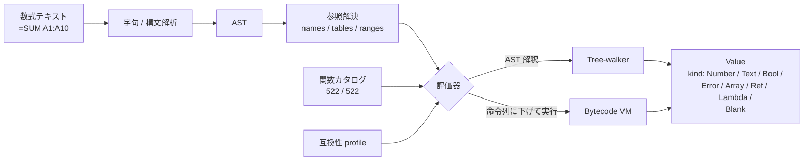

# 数式エンジン

評価器は scalar / range / array / error / reference / ロケール依存の挙動を Excel と一致させることを目指しています。関数カタログは起動時に登録され、各 binding はその中で評価できる関数を呼び出せます。

::: info 用語: tree-walker / bytecode VM
Formulon は 2 つの評価器を持ちます。tree-walker はパース済み AST をそのまま解釈し、bytecode VM は数式をコンパクトな命令列に下げて高速に実行します。両者は同じ結果を返す必要があり、テストでは並走させて差分が出ないか常に検査します。
:::

::: info 用語: value kind（値の種類）
セル値・数式結果に付く弁別子。`Blank` / `Number` / `Bool` / `Text` / `Error` / `Array` / `Ref` / `Lambda` の 8 種類。各 binding は enum として公開します（例: WASM `ValueKind.Number`、Python `ValueKind.NUMBER`）。
:::

## 関数カタログ

カタログは math、statistical、logical、text、date/time、lookup、financial、engineering、information、database、web、cube、近年追加の `LET` / `LAMBDA` / 動的配列系などの合計 522 件を対象としています。実行時レジストリでは現在 522 / 522 が実装済みです。カテゴリ別の内訳と検証方針は [数式カバレッジ](/ja/compatibility/formula-coverage) を参照してください。

::: info 関数登録 ≠ ワークブック互換
関数が実装されていても、ワークブックの最終結果はロケール挙動・ファイル構造・cached value・Excel の境界ケースに依存します。業務上重要な数式は小さな検証ファイルで確認してください。
:::

## 評価モード

tree-walker と bytecode VM は並走でき、互いの parity を検査します。同じワークブック・同じプロファイルで両者が一致することが、最適化を進める前提条件です。

## エラーの扱い

Excel error はホスト言語の例外ではなく **値** として扱います。

| Excel error | 意味 |
| --- | --- |
| `#DIV/0!` | 0 除算、または除数が空 |
| `#VALUE!` | 引数・オペランドの型不一致 |
| `#REF!` | 参照を解決できない（削除されたシート、壊れた range など） |
| `#NAME?` | 未知の関数 / defined name |
| `#NUM!` | 数値オーバーフローや不正な数値入力 |
| `#N/A` | 値なし。`MATCH` / `VLOOKUP` 系で発生 |
| `#NULL!` | 範囲交差が空 |
| `#SPILL!` | 動的配列の spill が成立しない（衝突・範囲外） |
| `#CALC!` | engine が結果を返せない（再帰・未完了評価など） |
| `#GETTING_DATA` | 外部参照の取得中 |

::: tip セルの error とホスト失敗は別物
`#DIV/0!` を返す数式は API として **失敗していません**。呼び出しは成功しており、結果が error *値* なのです。`value.kind === ValueKind.Error` で判定してください。bytes 不正・handle 失効・IO 失敗などは status envelope / 例外 / 非ゼロ終了で別経路で報告されます。
:::

## 座標

binding は 0-based の数値座標を使い、ロケールごとのアドレス解析を避けます。

| Excel のアドレス | binding のタプル `(sheet, row, col)` |
| --- | --- |
| `Sheet1!A1` | `(0, 0, 0)` |
| `Sheet1!B4` | `(0, 3, 1)` |
| `Sheet2!C10` | `(1, 9, 2)` |

A1 テキストは CLI 引数・数式文字列・MCP ツール入力など、明示的に要求している場面でのみ受け付けます。

## ロケール依存挙動

テキスト整形・日付パース・通貨・リスト区切りなど、一部関数は有効な compatibility profile を参照します。既定は `win-365-ja_JP`。対応する oracle データが揃ったプロファイルだけが公開されます。詳しくは [ロケールプロファイル](/ja/compatibility/locale-profiles)。

## 次に読むもの

- [再計算](/ja/workbook/recalculation) ─ engine が評価をどう順序付けるか
- [数式カバレッジ](/ja/compatibility/formula-coverage) ─ 関数族ごとの登録状況
- [エラーモデル](/ja/compatibility/errors) ─ error 値とホスト失敗の違い
