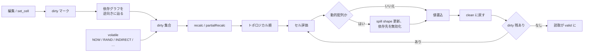

# 再計算

再計算はワークブックの編集を更新済みの計算値へ反映する工程です。WASM・Python・Native Node・CLI・MCP のいずれの surface も同じ再計算 core を経由するため、実行環境による挙動のずれは起きない設計になっています。

::: info 用語: dependency graph（依存関係グラフ）
数式から構築される有向グラフ。各数式セルは参照しているセル・defined name・external link を指しており、これによって engine は計算順序を決定し、変更があった範囲だけを再計算できます。
:::

::: info 用語: dirty cell（dirty なセル）
依存先の値が変わったため、現在の計算値が古い可能性があると engine がマークしたセルのこと。再計算はこの dirty 集合だけを評価して clean に戻します。
:::

## Engine が管理する状態

| 状態 | 用途 |
| --- | --- |
| 依存関係グラフ | 数式セル・defined name・table・external link 間の前向き / 後ろ向きエッジ |
| dirty 集合 | 読み取り前に再評価が必要なセル |
| volatile functions | `NOW` / `TODAY` / `RAND` / `INDIRECT` / `OFFSET` / `INFO` など、常に dirty 扱いの関数 |
| iterative 設定 | 循環参照を許容するための iteration 有効化・最大回数・収束しきい値 |
| dynamic-array spill shape | アンカーごとの結果 shape。依存セルの再 shape / 無効化に使う |
| calc mode | manual / automatic 切替（公開している surface のみ） |



## 全体再計算と partial recalc

`recalc()` はすべての dirty セルをトポロジカル順で再評価します。`partialRecalc()`（WASM）は指定した入力集合から到達可能なセルだけを対象とします。1 セルの編集や小規模なバッチで「変更箇所が完全に分かっている」場合に partial 側を使うと、依存ファンアウトの分だけで済みます。

::: info 用語: volatile function
引数以外のもの（時刻・乱数・外部参照など）に値が依存する関数。引数が変わらなくても再計算のたびに評価され、依存先のセルを毎回 dirty 集合に引き込みます。
:::

## 反復計算（iterative calculation）

利息計算や goal-seek のように意図的な循環参照を持つワークブックでは iterative calculation を有効にします。Engine は循環部分を繰り返し評価し、前後の変化量が許容値を下回るか上限回数に達した時点で停止します。

```ts
wb.setIterative(true)
wb.setIterativeProgress(/*maxIterations*/ 100, /*maxChange*/ 0.001)
wb.recalc()
```

::: warning iteration 無効時の循環は error
iteration が無効な状態で循環が存在する場合、該当セルは `#REF!` / `#NUM!` などの Excel error 値を返します。ホスト側の例外にはなりません。循環参照を意図する場合は必ず iteration を有効にしてください。
:::

## 速さより正しさ

Formulon はテスト時に tree-walker と bytecode VM を並行実行し、最適化 path と素朴 path の出力一致を検査しています。互換性の判定には Excel から取得した oracle fixture を使い、oracle と一致しない速度最適化は受け付けません。

## 次に読むもの

- [数式エンジン](/ja/workbook/formula-engine) ─ 値の種類・座標・error 伝播
- [動的配列](/ja/workbook/dynamic-arrays) ─ spill shape と再計算の関係
- [Oracle testing](/ja/compatibility/oracle-testing) ─ 参照値の取得方法
