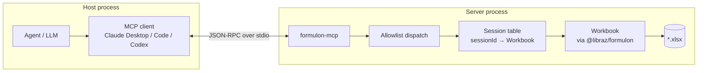

# formulon-mcp

`@libraz/formulon-mcp` is a stdio [MCP](https://modelcontextprotocol.io/) server for Formulon. It gives AI agents a controlled way to open `.xlsx` workbooks, inspect structure, edit cells and sheets, recalculate formulas, search and replace text, and save the result — without Excel and without writing a host integration first.

Use it when the workbook is the artifact you want the agent to operate on, not just a file to summarize.

::: info Glossary: MCP (Model Context Protocol)
An open protocol for giving AI agents structured tools and resources. A *server* exposes typed tool definitions over stdio or HTTP; a *client* (Claude Desktop, Claude Code, Codex CLI, …) connects and lets the model call those tools with validated inputs.
:::

::: info Glossary: stdio transport
The simplest MCP transport. The client launches the server as a child process and talks JSON-RPC over its stdin / stdout. No network, no ports — the OS process boundary is the security boundary.
:::



## Where to start

| Page | When to read |
| --- | --- |
| [Install](/mcp/install) | Add `formulon-mcp` to Claude Code, Claude Desktop, Codex CLI, or any stdio-capable client |
| [Workflow](/mcp/workflow) | Session model, mutation patterns, recalc / save loop |
| [Tools](/mcp/tools) | Detailed tool reference grouped by category |
| [Security model](/mcp/security) | Allowlist, session isolation, what the server will and will not do |

## Package

The MCP server is published as `@libraz/formulon-mcp` and uses `@libraz/formulon@0.9.0` under the hood. It requires **Node.js 22 or newer**.

```sh
npx -y @libraz/formulon-mcp
```

No project checkout is required for typical use — MCP clients run the published package through `npx`.

## What it is not

- Not a chat front-end. It is a tool server.
- Not a sandbox for running arbitrary code. Only allowlisted `Workbook` methods are reachable.
- Not a viewer. Hand the bytes to [`formulon-cell`](/cell/) for a browser surface.

## Read next

- [Install](/mcp/install) — wire it up to your MCP client.
- [Workflow](/mcp/workflow) — the open / mutate / recalc / save loop.
- [Tools](/mcp/tools) — what each tool does and when to reach for it.
