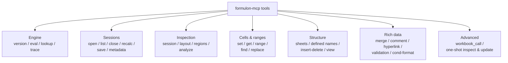

# Tools

This page lists every MCP tool exposed by `formulon-mcp`, grouped by purpose. The model receives the same descriptions through MCP tool discovery; this page mirrors them so a human can scan the surface at a glance.

::: info A1 vs zero-based
Unless A1 notation is used, sheet / row / column indices are zero-based to match the Formulon API. Both styles are accepted on tools that take addresses.
:::

## Engine

| Tool | What it does |
| --- | --- |
| `formulon_version` | Returns the loaded Formulon engine version. |
| `formulon_eval_formula` | Evaluates one Excel formula in a throwaway workbook. |
| `formulon_function_lookup` | Lists registered functions and resolves metadata or localized names. |
| `formulon_trace` | Reads precedents, dependents, or spill info for a cell. |

## Sessions

| Tool | What it does |
| --- | --- |
| `formulon_open_workbook` | Loads an `.xlsx` path into a new session, or creates a default workbook. |
| `formulon_list_sessions` | Lists open workbook sessions. |
| `formulon_close_workbook` | Releases a session. |
| `formulon_recalc_session` | Triggers a recalculation on an open session. |
| `formulon_save_session` | Writes a session to an `.xlsx` path or returns bytes inline. |
| `formulon_session_metadata` | Reads function names or external links from the session. |

## Inspection

| Tool | What it does |
| --- | --- |
| `formulon_inspect_session` | Returns sheets, defined names, tables, and optionally sparse cell entries. |
| `formulon_inspect_layout` | Per-sheet layout: used ranges, merges, row / column overrides, protection, cells, calculated values, formulas, and optional style details. |
| `formulon_detect_regions` | Detects table-like regions, label-value pairs, and totals with rule-based confidence and evidence. |
| `formulon_analyze_workbook` | Classifies workbook shape (invoice, list, report, schedule, form, …) with deterministic evidence. |

## Cells and ranges

| Tool | What it does |
| --- | --- |
| `formulon_set_cells` | Applies mutations to a session. Cells use A1 (`Sheet1!B2`) or 0-based (`sheet` / `row` / `col`). |
| `formulon_get_cell` | Reads one cell, either from a session or directly from a path. |
| `formulon_get_range` | Reads an A1 rectangular range from a session. |
| `formulon_find_cells` | Searches text cell values and / or formula text. |
| `formulon_replace_cells` | Replaces matching text and / or formula text. |

## Workbook structure

| Tool | What it does |
| --- | --- |
| `formulon_sheet_operation` | Adds, removes, renames, or moves sheets. |
| `formulon_set_defined_name` | Adds, replaces, or removes workbook-scoped defined names. |
| `formulon_edit_structure` | Inserts or deletes rows and columns. |
| `formulon_set_sheet_view` | Sets zoom, frozen panes, or sheet-tab hidden state. |

## Rich workbook data

| Tool | What it does |
| --- | --- |
| `formulon_merge_operation` | Lists, adds, removes, or clears merged ranges. |
| `formulon_comment_operation` | Gets, sets, or removes cell comments. |
| `formulon_hyperlink_operation` | Lists, adds, removes, or clears hyperlinks. |
| `formulon_validation_operation` | Lists, adds, removes, or clears data validations. |
| `formulon_conditional_format_operation` | Lists, adds, removes, clears, or evaluates conditional formats. |

## Advanced

| Tool | What it does |
| --- | --- |
| `formulon_workbook_call` | Allowlisted low-level access to the Formulon `Workbook` API. |
| `formulon_inspect_workbook` | One-shot summary from path. |
| `formulon_update_workbook` | One-shot load / create, mutate, recalculate, save. |

::: warning `workbook_call` is allowlisted, not arbitrary
`formulon_workbook_call` only dispatches methods on the server's allowlist (see [Security model](/mcp/security)). Calls to non-allowlisted methods are rejected. The tool exists for advanced access — PivotTables, PivotCaches, styles, dependency graph queries, function metadata, spill info — that the higher-level tools do not cover yet.
:::

## Read next

- [Workflow](/mcp/workflow) — the canonical loop.
- [Security model](/mcp/security) — what the server will refuse.
