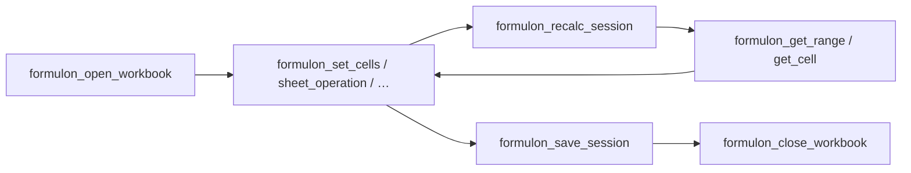

# MCP Workflow

The server is **session-oriented**. Open a workbook once, perform many operations against a `sessionId`, then save and close it. This avoids reparsing the file on every tool call and keeps formula evaluation state coherent.

::: info Glossary: session
An in-memory open workbook plus its engine state, keyed by a string `sessionId`. Sessions are isolated from each other — two open files have separate caches, dirty sets, and dependency graphs.
:::



## Open

```json
{
  "path": "input.xlsx",
  "sessionId": "work"
}
```

To create a fresh workbook instead of loading one, omit `path`. The server then returns a session backed by a default workbook with `Sheet1`.

## Mutate cells

```json
{
  "sessionId": "work",
  "mutations": [
    { "type": "number",  "a1": "Sheet1!A1", "value": 41 },
    { "type": "formula", "a1": "Sheet1!B1", "formula": "=A1+1" }
  ],
  "recalc": true
}
```

`recalc: true` triggers a recalculation at the end of the mutation batch. Set it to `false` when you intend to batch multiple `set_cells` calls before triggering a single recalc.

::: tip A1 or zero-based — pick one
Each mutation may address the target cell as `a1: "Sheet1!B2"` *or* as `sheet`, `row`, `col` integers. The integer form is 0-based and matches the Formulon API. Pick one style per workflow to keep agent outputs readable.
:::

## Read

```json
{
  "sessionId": "work",
  "range": "Sheet1!A1:B1"
}
```

Returns the values in the rectangle, kind-tagged. For a single cell, use `formulon_get_cell` instead.

## Recalculate explicitly

When mutations were applied without `recalc: true`, trigger one explicit pass:

```json
{ "sessionId": "work" }
```

through `formulon_recalc_session` before reading dependent values.

## Find / replace

```json
{
  "sessionId": "work",
  "query": "budget",
  "target": "both",
  "matchCase": false
}
```

```json
{
  "sessionId": "work",
  "query": "budget",
  "replacement": "forecast",
  "target": "texts",
  "recalc": true
}
```

`target` can be `texts`, `formulas`, or `both` — useful for refactoring formula references without touching unrelated text cells.

## Save

```json
{
  "sessionId": "work",
  "outputPath": "output.xlsx"
}
```

If `outputPath` is omitted, the server returns the bytes inline (base64) — useful for agents that hand the result back to the user.

## Close

```json
{ "sessionId": "work" }
```

Releases the session's engine state. Sessions also expire when the server process exits, but releasing explicitly is cheaper and clearer when running long agent sessions.

## One-shot helpers

Some tools combine the whole loop in a single call when the agent only needs the final result:

| Tool | Effect |
| --- | --- |
| `formulon_eval_formula` | Evaluates a formula in a throwaway workbook |
| `formulon_inspect_workbook` | Opens, summarizes, and closes — no session retained |
| `formulon_update_workbook` | Loads / creates, applies mutations, recalculates, saves — no session retained |

Use them when the agent does not need follow-up reads on the same workbook.

## Read next

- [Tools](/mcp/tools) — every tool grouped by category.
- [Security model](/mcp/security) — what is and is not allowed.
