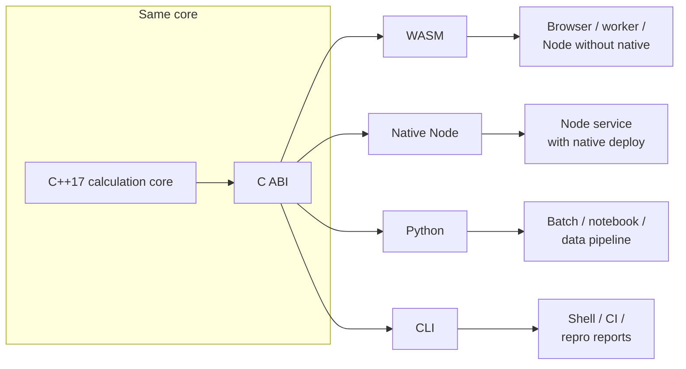

# Runtimes

Formulon ships one calculation core through several host surfaces. Choose by deployment constraints, not by formula semantics. If two runtimes disagree on a workbook, treat that as a bug or a documented compatibility gap.

::: info Same engine, different host contract
WASM, Python, Native Node, and CLI should share calculation behavior. What changes is packaging, file access, memory ownership, startup cost, and how errors cross the host boundary.
:::

| Runtime | Use when |
| --- | --- |
| [WASM](/runtimes/wasm) | Browser, worker, or Node deployment without native addon assumptions |
| [Python](/runtimes/python) | Scripts, notebooks, data pipelines, and batch recalculation |
| [Native Node](/runtimes/node-native) | Node services that can deploy a platform-specific `.node` addon |
| [CLI](/runtimes/cli) | Shell workflows, CI snapshots, and issue reproduction |
| [CI regression](/runtimes/ci-regression) | Stable workbook diffs in automated checks |

## Decision rules

- Use WASM when workbook data starts in the browser, when upload privacy matters, or when a server should not receive the raw file.
- Use Python when the workbook is part of report generation, scheduled jobs, data validation, or notebook workflows.
- Use Native Node only when a service can ship native artifacts and wants lower startup overhead than WASM.
- Use CLI for reproducible issue reports, CI snapshots, and one-off recalculation checks.

## API entry points

The detailed API pages are grouped under this runtime section instead of being a top-level navigation category:

| API page | Purpose |
| --- | --- |
| [Surface matrix](/api/surfaces) | Compare package surfaces and host responsibilities |
| [WASM API](/api/wasm) | Browser / worker usage and lifetime management |
| [Python API](/api/python) | Batch recalculation and workbook inspection |
| [CLI reference](/api/cli) | Shell automation and CI usage |

## What is not decided here

Runtime choice does not prove Excel compatibility. Before using Formulon for business-critical workbooks, check [Compatibility](/compatibility/) and run fixtures against your own files.
