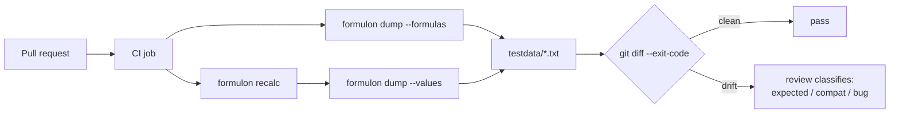

# CI Workbook Regression

Use the CLI to make workbook changes visible in code review. A workbook that someone hand-edited in Excel is otherwise an opaque binary; running it through Formulon turns the diff into something a reviewer can read.

::: warning Volatile formulas
Direct value snapshots are a poor fit for uncontrolled `NOW`, `TODAY`, `RAND`, and `RANDBETWEEN` formulas. Either isolate them, document them, or avoid value snapshots for those workbooks.
:::

::: info Glossary: golden file
A checked-in expected-output file that a test compares against the current output. When they diverge, the test fails and the reviewer decides whether the divergence is intentional (update the golden) or a regression (fix the code or the workbook).
:::

## Pipeline shape



## Formula drift

```sh
formulon dump --formulas model.xlsx > testdata/model.formulas.txt
git diff --exit-code testdata/model.formulas.txt
```

Formula snapshots catch workbook authoring changes even when cached values are stale. They are cheap because no recalculation is involved.

## Value drift

```sh
formulon recalc model.xlsx -o /tmp/model.recalc.xlsx --quiet
formulon dump --values /tmp/model.recalc.xlsx > testdata/model.values.txt
git diff --exit-code testdata/model.values.txt
```

Value snapshots catch changes in calculated output. `dump --values` triggers a recalculation first, so the snapshot reflects what the engine actually computes — not the cached values that happened to be in the file.

## GitHub Actions example

```yaml
name: workbook regression
on: [pull_request]
jobs:
  workbook:
    runs-on: ubuntu-latest
    steps:
      - uses: actions/checkout@v4
      - name: Install formulon CLI
        run: |
          curl -L -o formulon "https://github.com/libraz/formulon/releases/latest/download/formulon-cli-linux-x86_64"
          chmod +x formulon
          sudo mv formulon /usr/local/bin/
      - name: Snapshot formulas
        run: |
          formulon dump --formulas model.xlsx > testdata/model.formulas.txt
      - name: Snapshot values
        run: |
          formulon recalc model.xlsx -o /tmp/model.xlsx --quiet
          formulon dump --values /tmp/model.xlsx > testdata/model.values.txt
      - name: Fail on diff
        run: |
          git diff --exit-code testdata/
```

The job is deterministic for the same workbook + profile + Formulon version, so the only way the step fails is if the workbook or the engine changed — both worth a review.

## Review policy

Require reviewers to classify diffs as:

- expected formula edits,
- expected input changes,
- Formulon compatibility differences,
- Excel behavior changes,
- bugs.

This keeps workbook regression tests from becoming opaque golden files. The reviewer's classification is captured in the PR body (or a commit trailer); future contributors looking at the same diff can see why it was accepted.

::: tip Pin Formulon version in CI
The dump output format and value semantics are stable across patch releases but pin the Formulon version (or the CLI binary URL) explicitly so an unrelated release upgrade does not show up as a workbook regression.
:::

## Read next

- [CLI workflows](/runtimes/cli) — the commands behind this scenario.
- [CI regression runtime page](/runtimes/ci-regression) — broader patterns.
- [Compatibility model](/compatibility/model) — why pinning a profile matters.
