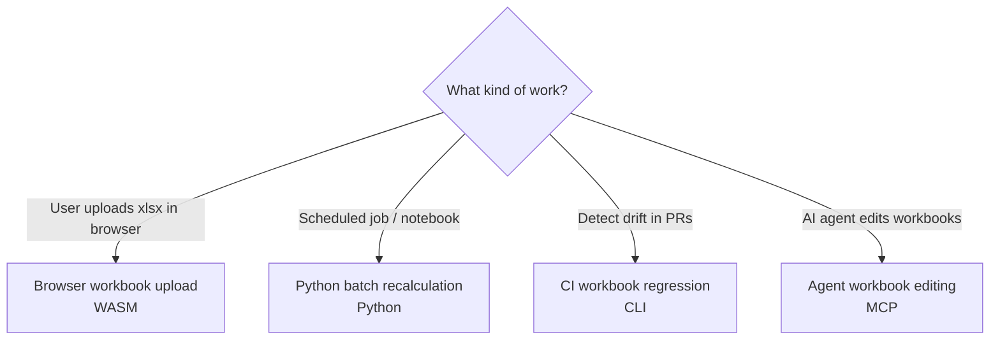

# Scenarios

These pages show how Formulon fits into concrete workflows. Each scenario chooses a different runtime — pick the one closest to your deployment, then read the matching [Runtime](/runtimes/) page for setup details.

::: info Start with a real workbook
After the one-formula quick start, test one representative workbook as early as possible. Spreadsheet engines fail or succeed on workbook details, not only on isolated formulas.
:::

| Scenario | Runtime | Goal |
| --- | --- | --- |
| [Browser workbook upload](/scenarios/browser-upload) | WASM | Recalculate a user-uploaded `.xlsx` without sending it to a server |
| [Python batch recalculation](/scenarios/python-batch) | Python | Recalculate reports or models in jobs and notebooks |
| [CI workbook regression](/scenarios/ci-regression) | CLI | Detect formula and value drift in automated checks |
| [Agent workbook editing](/mcp/) | MCP | Let AI agents open, edit, recalculate, and save `.xlsx` through `formulon-mcp` |

## What the scenarios share

Every scenario follows the same `load → mutate → recalc → save` lifecycle described in [Workbook lifecycle](/workbook/lifecycle). What changes between them is:

- where the bytes come from (`File`, file system, IO stream, MCP tool input),
- where the bytes go (`save()` result, written file, returned `bytes` field),
- which runtime owns memory and IO,
- how errors cross the host boundary.

For runtime-specific setup, see [Runtimes](/runtimes/). For the engine-side flow, see [Workbook lifecycle](/workbook/lifecycle).
