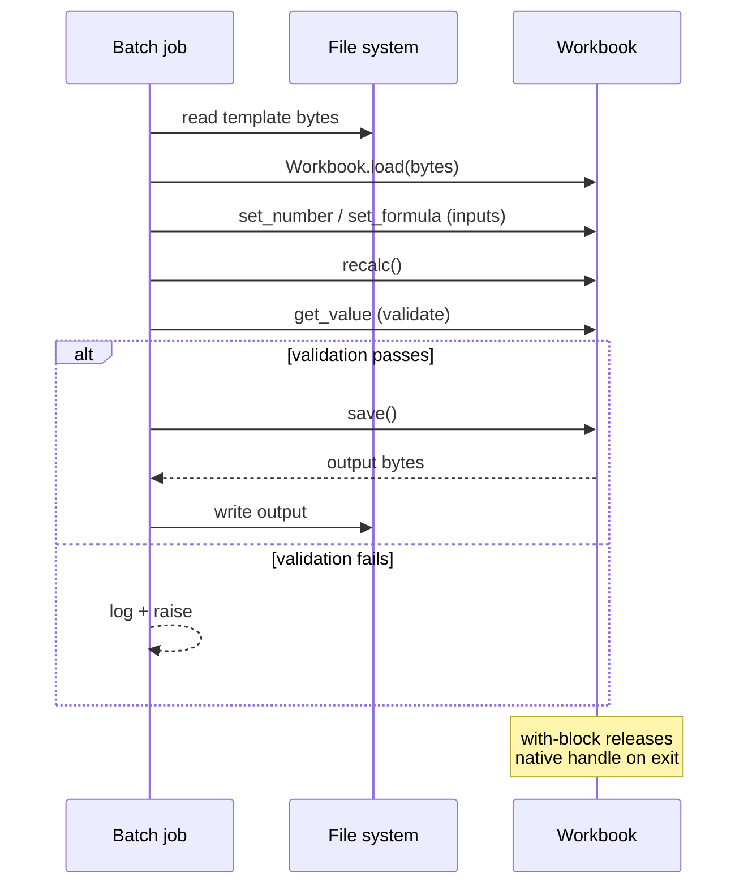

# Python Batch Recalculation

Use Python when spreadsheet recalculation is part of a scheduled job, notebook, or data pipeline. The same engine that runs in the browser runs here — only the host language changes.

::: tip Keep workbook IO at the edges
Load bytes at the start, perform explicit mutations and recalc, write bytes at the end. Avoid mixing calculation logic with unrelated data-loading code; that makes failures easier to attribute and tests easier to write.
:::

::: info Glossary: scheduled job
A recurring batch process — typically run by cron, Airflow, GitHub Actions, or a cloud scheduler — that consumes one or more input artifacts and produces output artifacts. Stateless, idempotent jobs are the easiest to operate; Formulon's `load → mutate → recalc → save` shape fits cleanly.
:::

## Flow



## Example job

```python
from pathlib import Path
from formulon import Workbook

def recalc_report(input_path: Path, output_path: Path, revenue: float) -> None:
    with Workbook.load(input_path.read_bytes()) as wb:
        wb.set_number(0, 3, 1, revenue)  # B4 on Sheet1
        wb.recalc()
        output_path.write_bytes(wb.save())

recalc_report(Path("template.xlsx"), Path("report.xlsx"), 125_000.0)
```

The `with` block releases the native handle on exit, including when an exception is raised inside.

## Mutating many cells

```python
from formulon import Workbook, ValueKind

INPUTS = [
    (0, 3, 1, 125_000.0),   # B4: revenue
    (0, 4, 1,  80_000.0),   # B5: COGS
    (0, 5, 1,  12_000.0),   # B6: marketing
]

with Workbook.load(template_bytes) as wb:
    for sheet, row, col, value in INPUTS:
        wb.set_number(sheet, row, col, value)
    wb.recalc()

    margin = wb.get_value(0, 8, 1)  # B9: gross margin
    if margin.kind is ValueKind.NUMBER and margin.number < 0:
        raise RuntimeError(f"Negative margin: {margin.number}")

    output_path.write_bytes(wb.save())
```

`set_number` / `set_text` / `set_formula` are the canonical mutators; coordinates are zero-based `(sheet, row, col)`. See [Workbook operations](/workbook/operations).

## Pinning the compatibility profile

```python
with Workbook.load(template_bytes) as wb:
    wb.set_excel_profile_id('win-365-ja_JP')
    wb.recalc()
    ...
```

CI fixtures and production jobs should pin a profile explicitly so locale-sensitive results are reproducible. See [Locale profiles](/compatibility/locale-profiles).

## Validation pattern

Keep a small set of fixture workbooks in your repository:

```sh
python jobs/recalc_reports.py
formulon dump --values report.xlsx > report.values.txt
git diff --exit-code report.values.txt
```

Pair the Python entrypoint with the CLI `dump --values` snapshot, and you have an end-to-end regression check that catches both code drift and workbook drift.

::: warning Volatile inputs need handling
`NOW`, `TODAY`, `RAND`, and the network functions return non-deterministic values. For golden snapshots, either replace them with fixed inputs at the template level or move them out of the snapshotted range.
:::

## Error handling

```python
from formulon import Workbook, FormulonError, ValueKind

try:
    with Workbook.load(blob) as wb:
        wb.recalc()
        value = wb.get_value(0, 0, 0)
        if value.kind is ValueKind.ERROR:
            # Cell-level Excel error — surface as data, not as exception
            log.warning("cell error: %s", value.error_code)
except FormulonError as e:
    # Host failure — bad bytes, missing handle, IO error
    log.error("formulon host failure: %s", e)
    raise
```

## Fit check

| Workflow | Recommended runtime |
| --- | --- |
| Cron-driven nightly reports | Python |
| Jupyter / Colab notebooks | Python |
| Browser-local recalculation | WASM |
| Node service with large workbook throughput | Native Node |
| Shell-driven CI snapshots | CLI |

## Read next

- [Python API](/api/python) — top-level surface.
- [Workbook lifecycle](/workbook/lifecycle) — engine flow behind the script.
- [CI workbook regression](/scenarios/ci-regression) — pairing Python with snapshots.
