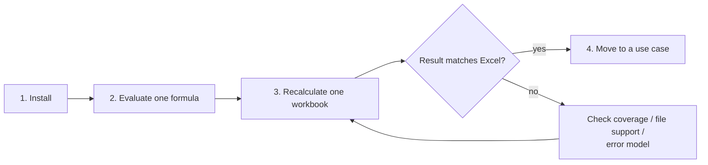

# Start

Formulon is a headless spreadsheet calculation engine. Start by running a small formula, then try one real workbook in the runtime closest to your product.

::: tip Start with a real workbook
The quickest way to understand Formulon is to recalculate a workbook you already use. The compatibility pages are there to explain differences when something does not match Excel.
:::

## Recommended path

1. Install the package for your runtime.
2. Run one formula through Formulon.
3. Recalculate one workbook.
4. If the result differs from Excel, check [Formula coverage](/compatibility/formula-coverage), [File format support](/compatibility/file-format-support), and [Error model](/compatibility/errors).
5. Move to a concrete [Use case](/scenarios/).

## First tasks

| Task | Page |
| --- | --- |
| Install packages | [Install](/start/install) |
| Evaluate a single formula | [Evaluate a formula](/start/evaluate) |
| Recalculate a workbook | [Recalculate a workbook](/start/recalculate) |
| Pick WASM, Python, Native Node, CLI, or C ABI | [Choose a runtime](/start/choose-runtime) |
| Fix common integration failures | [Troubleshooting](/start/troubleshooting) |
| Start from a concrete workflow | [Scenarios](/scenarios/) |

## Product-specific reading order

After the first run, read by concern:

- Runtime integration: [WASM](/runtimes/wasm), [Python](/runtimes/python), [Native Node](/runtimes/node-native), [CLI](/runtimes/cli)
- Workbook behavior: [Lifecycle](/workbook/lifecycle), [Formula engine](/workbook/formula-engine), [Recalculation](/workbook/recalculation)
- Compatibility: [Formula coverage](/compatibility/formula-coverage), [File format support](/compatibility/file-format-support), [Error model](/compatibility/errors)
- API details: [Surface matrix](/api/surfaces), [WASM API](/api/wasm), [Python API](/api/python), [CLI reference](/api/cli)
