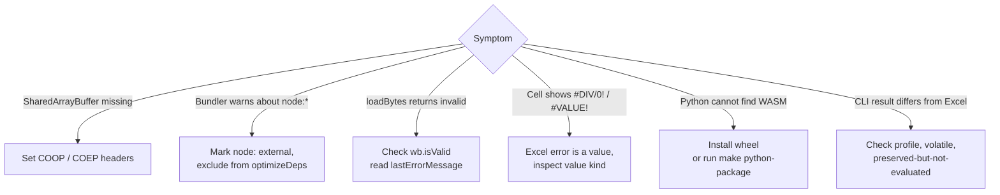

# Troubleshooting

This page covers common integration failures.



## Browser says SharedArrayBuffer is unavailable

Serve the page with cross-origin isolation headers:

```http
Cross-Origin-Opener-Policy: same-origin
Cross-Origin-Embedder-Policy: require-corp
```

::: tip Vite preview is not your production host
Check the headers in the actual deployed environment. A local dev server passing does not prove the CDN or app server is configured correctly.
:::

## Vite warns about `node:` imports

The WASM package contains a Node branch for Node runtime support. Browser bundlers may warn about `node:module` or `node:worker_threads`. In Vite, exclude the package from optimizeDeps and mark `node:` imports external.

```ts
export default defineConfig({
  optimizeDeps: { exclude: ['@libraz/formulon'] },
  build: {
    target: 'es2022',
    rollupOptions: { external: [/^node:/] }
  }
})
```

## Workbook load returns an invalid handle

In WASM, check `wb.isValid()` immediately after `loadBytes(bytes)` and read `Module.lastErrorMessage()`.

```ts
const wb = Module.Workbook.loadBytes(bytes)
if (!wb.isValid()) {
  throw new Error(Module.lastErrorMessage())
}
```

## Formula returns an Excel error

Excel errors are values. `#DIV/0!`, `#VALUE!`, and `#NAME?` do not mean the host API failed. Inspect the value kind and error payload.

## Python cannot load the WASM runtime

Install the published wheel so pip can resolve a compatible `wasmtime` wheel, or
run the staging command from the repository root:

```sh
make python-package
```

The source-tree import expects the staged C-ABI WASM module under
`packages/python/formulon/_wasm/`.

## CLI result differs from Excel

Check these first:

- whether the function is registered but intentionally returns an Excel error for an unavailable service, such as `PY` or CUBE connection functions,
- whether the workbook depends on locale behavior outside `win-365-ja_JP`,
- whether volatile functions are involved,
- whether the workbook structure is preserved but not evaluated.

Create a minimal formula case and compare it with [Formula coverage](/compatibility/formula-coverage) and [Oracle testing](/compatibility/oracle-testing).
