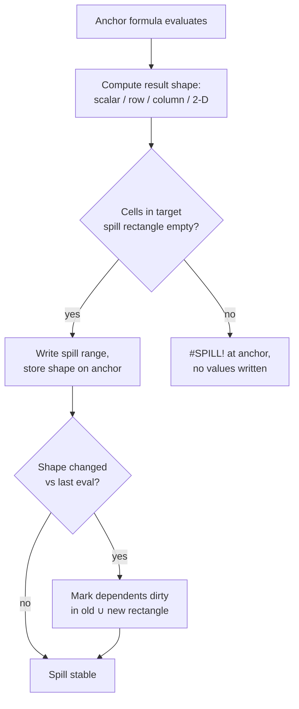

# Dynamic Arrays

Dynamic arrays let one formula return multiple values that *spill* into neighboring cells. The anchor cell holds the formula; the surrounding spill range holds the computed values. Formulon models the spill shape, dependency edges, and collision behavior as part of recalculation.

::: info Glossary: spill / spill range
The rectangle of cells produced when a dynamic-array formula returns more than one value. The top-left cell (the *anchor*) holds the formula text; the other cells in the spill range are read-only projections of the result.
:::

::: info Glossary: anchor cell
The cell that owns the dynamic-array formula. Editing or clearing the anchor changes the whole spill. Cells inside the spill (non-anchor) cannot be edited directly — clearing them is a no-op until the anchor is changed.
:::

## What to expect

- Spill ranges are computed from the formula's result shape (scalar, row, column, or 2-D array).
- A formula that changes shape dirties dependent cells and recomputes their spill anchors.
- Collisions — when a spill would overwrite a non-empty cell — return `#SPILL!` rather than silently overwriting data.
- Dimension mismatches (e.g. mixing a 3-row argument with a 5-row argument under implicit broadcasting) follow Excel's error rules per function family.



## Functions that spill

Spill behavior is most visible with:

```text
=SEQUENCE(5)
=UNIQUE(A1:A100)
=SORT(A1:B20, 2, -1)
=FILTER(A1:C50, B1:B50 > 0)
=LET(x, A1:A10, x * 2)
```

Implicit intersection (`@`) is still supported for backward compatibility with workbooks authored in pre-dynamic-array Excel.

## v0.9.2 array-function updates

v0.9.2 tightened Excel parity for several array-aware functions:

- `MAP` and `MAKEARRAY` now spill errors in the same shape Excel reports for the covered oracle cases.
- `WRAPROWS` and `WRAPCOLS` align their output shape and padding behavior with the Mac Excel oracle.
- `TRIMRANGE` blank handling was adjusted so leading / trailing blank rows and columns match the oracle more closely.

## Recalculation interaction

The recalc engine stores per-anchor spill metadata:

| Field | Purpose |
| --- | --- |
| Anchor address | Sheet / row / column of the formula owner |
| Result shape | Rows × columns of the last successful evaluation |
| Spill error | `#SPILL!` if the result could not materialize; otherwise null |
| Dependents on the range | Cells that read from any address in the spill range |

When the anchor recomputes to a different shape, dependents anywhere in the old or new spill rectangle are marked dirty.

::: tip Inspecting spill state
WASM and Native Node expose `spillInfo(sheet, row, col)` and the MCP `formulon_trace` tool reads precedents, dependents, and spill info from a session. Use these when a workbook formula returns `#SPILL!` and you need to find what occupies the target cells.
:::

## Compatibility caveats

Dynamic-array semantics depend on workbook-level flags and on whether legacy CSE arrays exist in the same sheet. Mixed dynamic-array / CSE workbooks should be checked against oracle fixtures before relying on the results.

## Read next

- [Recalculation](/workbook/recalculation) — how dirty cells and spill shape interact.
- [Formula coverage](/compatibility/formula-coverage) — which array-aware functions are registered.
- [Error model](/compatibility/errors) — how `#SPILL!` differs from host failures.
