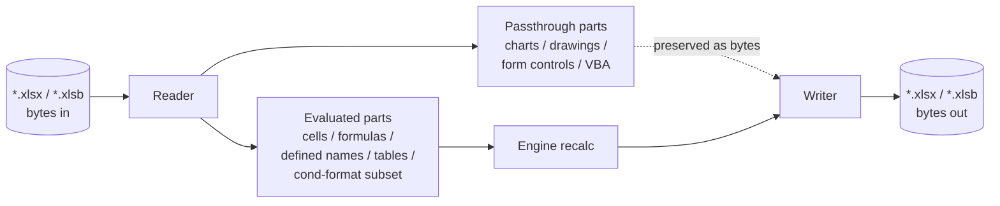

# File Formats

Formulon focuses on modern Office Open XML and binary spreadsheet formats. The same calculation core sits behind every reader and writer, so the format layer is responsible for shape preservation and feature mapping rather than calculation behavior.

::: info Glossary: OOXML
Office Open XML — the ISO/IEC 29500 family of zipped XML formats Microsoft Office uses, including `.xlsx`, `.xlsm`, and `.xltx`. Each `.xlsx` is a ZIP container whose parts (workbook, sheets, styles, shared strings, relationships, …) describe the document.
:::

::: info Glossary: passthrough part
A workbook part that Formulon parses just enough to preserve on save without claiming semantic ownership. The bytes survive a recalculation round-trip even when the engine does not evaluate the feature.
:::

## XLSX

The OOXML reader/writer handles:

- workbook parts and relationships,
- worksheets and their cells, formulas, and cached values,
- styles, number formats, fonts, fills, borders, themes,
- shared strings,
- tables and defined names,
- comments and threaded comments,
- hyperlinks,
- merges,
- data validations,
- conditional formatting,
- pivot tables and pivot caches (layout-level subset),
- external links,
- protection metadata,
- sheet views, freeze panes, hidden tabs,
- per-row / per-column overrides.

::: tip Caching behavior
On load, formula cells keep both the formula text and the cached value found in the file. After `recalc()`, the cached values are replaced with the engine's computed values; on save, the file contains coherent formula / value pairs.
:::

## XLSB

The binary workbook path exists for workflows that need MS-XLSB reading and writing while keeping the same calculation model. The supported workbook feature set is a subset of the XLSX writer, focused on cells, sheets, styles, defined names, and tables.

## What is preserved vs. evaluated

| Feature | Read | Recalculate | Write |
| --- | --- | --- | --- |
| Formulas in cells | yes | yes | yes |
| Styles / number formats | yes | n/a | yes |
| Defined names / tables | yes | yes (resolved as references) | yes |
| Conditional formatting | yes | partial (evaluate subset) | yes |
| Pivot tables | layout / cache (subset) | no | yes |
| Charts | parts preserved | no | yes |
| Form controls / drawings | passthrough | no | yes |
| VBA project | passthrough | never | yes |

::: warning VBA is preserved, not run
Workbooks containing VBA can round-trip through Formulon, but macros are never executed. Calculations that depend on macro-side state will diverge from Excel.
:::

## Non-goals

- Legacy `.xls` (BIFF) read / write.
- CSV is supported only via simple ingestion; rich Excel CSV quoting edge cases are not the target.
- Live external connections (PowerQuery, OLE DB, Web).

## Read next

- [Lifecycle](/workbook/lifecycle) — how bytes become the workbook model.
- [Operations](/workbook/operations) — sheet, cell, and structure edits.
- [Compatibility / File format support](/compatibility/file-format-support) — read / write / preserve matrix.
