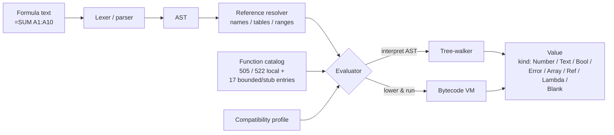

# Formula Engine

The evaluator is designed to match Excel semantics for scalar values, ranges, arrays, errors, references, and locale-sensitive behavior. The function catalog is registered at startup; bindings expose enough of it to evaluate any registered function.

::: info Glossary: tree-walker vs bytecode VM
Formulon ships two evaluators. The tree-walker interprets the parsed AST directly; the bytecode VM lowers formulas to a compact instruction stream that runs faster on hot paths. Both must produce the same values — tests run them in parallel so the optimized path stays honest.
:::

::: info Glossary: value kind
The discriminator on every cell or formula result. The kinds are `Blank`, `Number`, `Bool`, `Text`, `Error`, `Array`, `Ref`, and `Lambda`. Each binding exposes them as an enum (e.g. WASM `ValueKind.Number`, Python `ValueKind.NUMBER`).
:::

## Function catalog

The catalog tracks 522 Excel function names across math, statistical, logical, text, date/time, lookup, financial, engineering, information, database, web, cube, and recent (LET / LAMBDA / dynamic array) families. That is the recognition catalog, not a claim that every Microsoft 365 service-backed function is locally implemented.

As of v0.9.2, **505 / 522** catalog entries have real local engine implementations, 2 are environment-bound (`CELL`, `INFO`), and 15 are deliberate unavailable stubs for features that require external services or live connections. See [Formula coverage](/compatibility/formula-coverage) for the category and availability breakdown.

## Evaluation modes

The tree-walker and bytecode VM can run in parallel for parity checks. That keeps optimization work honest: the faster path must produce the same values as the simpler path, on the same workbook, under the same profile.

## v0.9.2 evaluation updates

v0.9.2 made several Excel-parity fixes that can change edge-case results:

- numeric literals are truncated to Excel's 15-significant-digit representation during parsing;
- `ARRAYTOTEXT` propagates a scalar error argument instead of formatting around it;
- `FREQUENCY` follows Excel's bin-ordering behavior more closely;
- `PERCENTILE.EXC` returns `#NUM!` at the upper boundary (`pos == n`) instead of returning the largest sample value.

## Error behavior

Excel errors are values, not host-language exceptions:

| Excel error | Meaning |
| --- | --- |
| `#DIV/0!` | Division by zero or empty divisor |
| `#VALUE!` | Type mismatch in operands or arguments |
| `#REF!` | Reference no longer resolvable (deleted sheet, broken range) |
| `#NAME?` | Unrecognized function or defined name |
| `#NUM!` | Numeric overflow or invalid numeric input |
| `#N/A` | Value not available, typically from `MATCH` / `VLOOKUP` style functions |
| `#NULL!` | Intersection produced an empty range |
| `#SPILL!` | Dynamic array could not spill (collision or out-of-bounds) |
| `#CALC!` | Engine could not produce a result (recursion, unfinished evaluation) |
| `#GETTING_DATA` | Asynchronous external lookup in progress |

::: tip Cell error vs host error
A formula returning `#DIV/0!` is not an API failure. The host call succeeded; it produced an error *value*. Inspect `value.kind === ValueKind.Error` to handle it. Host-side failures (bad bytes, missing handle, IO error) flow through status envelopes / exceptions / non-zero exits instead.
:::

## Coordinates

Bindings use zero-based numeric coordinates to avoid locale-specific address parsing:

| Excel address | Binding tuple `(sheet, row, col)` |
| --- | --- |
| `Sheet1!A1` | `(0, 0, 0)` |
| `Sheet1!B4` | `(0, 3, 1)` |
| `Sheet2!C10` | `(1, 9, 2)` |

A1 text is accepted only where a CLI argument, formula string, or MCP tool input explicitly expects it.

## Locale-sensitive behavior

Some functions (text formatting, date parsing, currency, list separators) read from the active compatibility profile. The default profile is `win-365-ja_JP`; alternative profiles are exposed only when matching oracle data exists. See [Locale profiles](/compatibility/locale-profiles).

## Read next

- [Recalculation](/workbook/recalculation) — how the engine schedules formula evaluation.
- [Formula coverage](/compatibility/formula-coverage) — registered functions by family.
- [Error model](/compatibility/errors) — error values vs host failures in depth.
