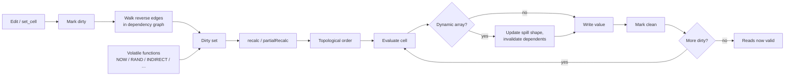

# Recalculation

Recalculation is the step that turns workbook edits into updated calculated values. Every host surface — WASM, Python, Native Node, CLI, MCP — flows through the same recalculation core, so behavior should not drift between runtimes.

::: info Glossary: dependency graph
A directed graph the engine builds from formulas. Each formula cell points to the cells (or named ranges, or external links) it reads from, so the recalc engine can compute things in the right order and recompute only what changed.
:::

::: info Glossary: dirty cell
A cell whose computed value is no longer known to be up to date because something it depends on changed. Recalculation visits dirty cells, evaluates them, and marks them clean again.
:::

## What the engine tracks

The recalculation engine keeps state across edits:

| State | Purpose |
| --- | --- |
| Dependency graph | Forward / reverse edges between formula cells, defined names, tables, and external links |
| Dirty set | Cells whose value must be recomputed before reads are valid |
| Volatile functions | Functions like `NOW`, `TODAY`, `RAND`, `INDIRECT`, `OFFSET`, `INFO` that are always treated as dirty |
| Iterative settings | Iteration enabled / disabled, max iterations, max change for cyclic models |
| Dynamic-array spill shapes | Per-anchor result shapes so dependents can be re-shaped or invalidated correctly |
| Calc mode | Manual or automatic recalculation for hosts that expose the toggle |



## Full vs partial recalculation

`recalc()` walks every dirty cell in topological order. `partialRecalc()` (WASM) recomputes only the cells reachable from a specified set of inputs. Use the partial variant when you know exactly which cells changed — typically a single user edit or a small batch — and want the dependent fan-out only.

::: info Glossary: volatile function
A function whose value depends on something other than its arguments (clock, randomness, external lookup) and so must be re-evaluated on every recalc, even when no input has changed. Volatiles drag their dependents into the dirty set every time.
:::

## Iterative calculation

Workbooks with intentional cycles — interest accrual, goal-seek style fixed points — need iterative calculation. The engine evaluates the cyclic subgraph repeatedly until the change between iterations falls below the configured tolerance or the iteration cap is hit.

```ts
wb.setIterative(true)
wb.setIterativeProgress(/*maxIterations*/ 100, /*maxChange*/ 0.001)
wb.recalc()
```

::: warning Cycles outside iteration are still errors
If iterative calculation is **off** and the workbook contains a cycle, the involved cells return `#REF!` / `#NUM!` style Excel errors rather than throwing a host exception. Turn iteration on explicitly when cycles are intentional.
:::

## Correctness over speed

Formulon runs an unoptimized tree-walker alongside an optimized bytecode VM in tests so the faster path can be checked against the simpler one. Oracle fixtures (Excel-derived reference values) gate compatibility changes. Speed work that would diverge from oracle data is rejected before it lands.

## Read next

- [Formula engine](/workbook/formula-engine) — value kinds, coordinates, error propagation.
- [Dynamic arrays](/workbook/dynamic-arrays) — spill shape and recalc interaction.
- [Oracle testing](/compatibility/oracle-testing) — how reference values are captured.
